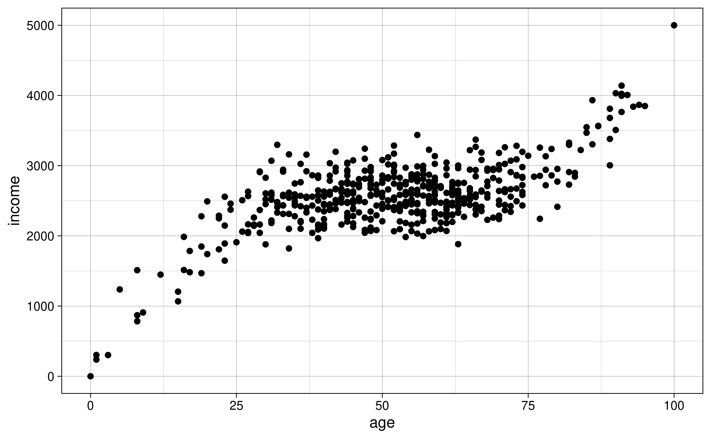
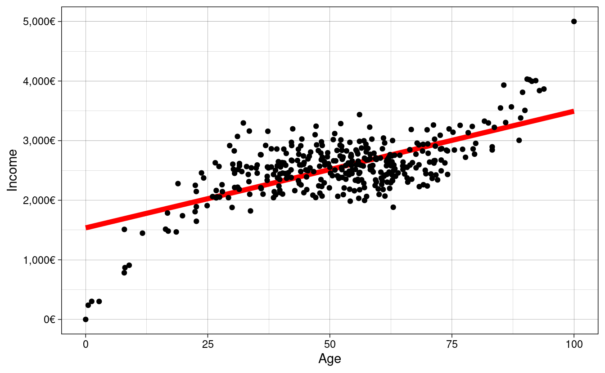
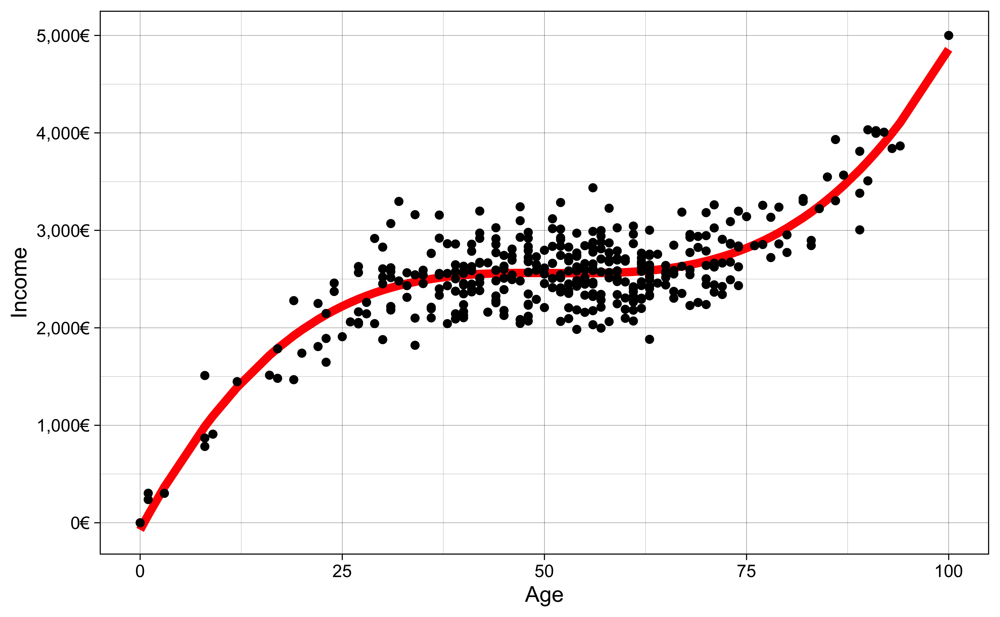
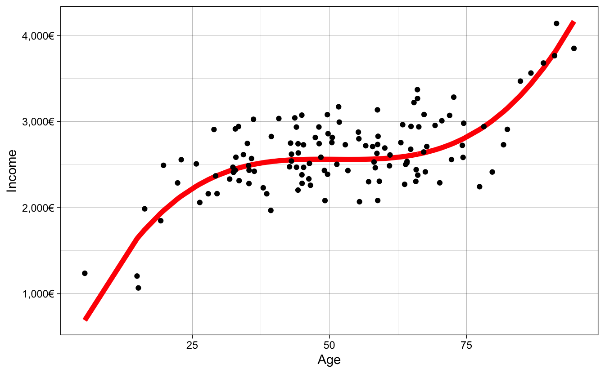

# Machine Learning for Social Scientists


Machine Learning practitioners and social scientists share many things in common. These shared traits are mostly related to the transformation, analysis and evaluation of statistical models. In fact, when many of my fellow social scientists take any introductory course on machine learning, I often hear that many of the things they get taught are very common in their social statistics classes. This is good news! This means that you already have a foot inside the field without even knowing it. Machine Learning practitioners use many of the same statistical model we use and also many of transformation techniques that we use. However, there are important differences on how we analyze data and how we answer our questions. In this chapter I will elaborate on how machine learning practitioners have developed strategies different from social scientists for analyzing their data, how their analysis workflow compares to ours and finally, a tour around their way of thinking, which has evolved to be very different from ours.

I hope that by understanding the strategies and techniques that machine learning practitioners use, social scientists would expand their analysis toolbox, allowing us to complement their way of thinking with our strong research design skills and modeling techniques.

## A different way of thinking

The first question we want to ask ourselves is, what is machine learning? Machine Learning bears indeed a fancy name which brings to mind thoughts related to artificial intelligence and robots. However, as you'll see throughout the course, most terms and models used in machine learning are actually what we know as **statistical models**. The overarching difference in the definition of machine learning and social statistics is not the models or new strategies for analyzing data. It is the main objective of the analysis. What is machine learning after all?

> Using statistical methods to learn the data enough to be able to predict it accurately on new data

That sounds somewhat familiar to us social scientists. Perhaps our goal is not to predict our data but it is certainly to **learn it** and **understand it**. In particular, social scientists are interested in figuring out if our theoretical description of a problem fits the data we have collected or have at hand. We do that by carefully building a model that explains the problem really well such that we can extrapolate an explanation for the problem from the data. Our gold standard to check whether we did a good job is to collect the exact same data again and see if our final models replicates. How does this differ from the way of thinking of machine learning practitioners? The main objective in a machine learning problem is accurate predictions; that is, regardless of how well they **understand** a problem, they want to learn the data enough to predict it well. Prediction problems are usually concerned with **building and tweaking** a model that predicts a dependent variable accurately on your data, such that when **new data** arrives, the model can predict it just as accurately. This does not mean that machine learning practitioners don't have domain-specific knowledge of what they're trying to predict (they have to select variables to include in a model just as we do). However, 'parsimonious models' (that is, simple and interpretable models) are not something they're limited to (in contrast, social scientists hardly experiment with non-interpretable models). They might use models which contain up to hundreds of variables if that increases predictive accuracy. Although that might sound counter-intuitive to social scientists, more and more ground is being gained by this type of thinking in the social sciences [@watts2014; @yarkoni2017].

The difference between how we both approach research questions is the problem of inference versus prediction [@breiman2001]. That is the fundamental difference between the approach used by social scientists and practitioners of machine learning. However, for having such drastic differences in our objective, we share a lot of common strategies. For example, here's the typical workflow of a social scientist:


This is our safe zone: we understand these steps and we've exercised them many times. We begin by importing our data and immediately start to clean it. This involves, for example, collapsing fine grained groups into bigger categories, transforming variables using logarithms and creating new variables which reflect important concepts from our theoretical model. Once we're confident with our set of variables, we begin the iterative process of visualizing our data, fitting statistical models and evaluating the fit of the model. This is an iterative process because the results of our model might give us ideas on new variables or how to recode an existing variable. This prompts us to repeat the same process again with the aim of carefully building a model that fits the data well. Well, let me break it to you but this same process is very familiar to the machine learning process:


They import their data, they wrangle their data, they fit statistical models, and they evaluate the fit of their models. They might have different names for the same things but in essence, they are more or less the same. For example, here are some common terms in the machine learning literature which have exact equivalents in social statistics:

 * Features --> Variables
 * Feature Engineering --> Creating Variables
 * Learning Algorithms --> Statistical Models
 * Supervised Learning --> Models that have a dependent variable
 * Unsupervised Learning --> Models that don't have a dependent variable, such as clustering
 * Classifiers --> Models for predicting categorical variables, such as logistic regression
 
 and you'll find more around. These are the common steps which you'll find between both fields. However, machine learning practitioners have developed extra steps which help them achieve their goal of predicting new data well:
 


* Training/Testing data --> Unknown to us
* Cross-validation --> Unknown to us
* Grid search --> Unknown to us
* Loss functions --> Model fit --> Known to us but are not predominant ($RMSE$, $R^2$, etc...)

These are very useful concepts and we'll focus on those in this introduction. In this introduction I won't delve into the statistical models (learning algorithms) used in machine learning as these will be discussed in later chapters but I wanted to highlight that although they share similarities with the models used in social statistics, there are many models used in the machine learning literature which are unknown to us. Let's delve into each of these three new concepts.

Before we beginning explaining these concepts and using R, let's load the packages we'll use in this chapter:


```r
# All these packages can be installed with `install.packages`
library(ggplot2)
library(patchwork)
library(scales)
library(tidymodels)
```

## Split your data into training/testing

Since the main objective in machine learning is to predict data accurately, all of their strategies are geared towards avoiding overfitting/underfitting the data. In other words, they want to capture all the signal and ignore the noise:


```r
set.seed(2313)
n <- 500
x <- rnorm(n)
y <- x^3 + rnorm(n, sd = 3)
age <- rescale(x, to = c(0, 100))
income <- rescale(y, to = c(0, 5000))

age_inc <- data.frame(age = age, income = income)

y_axis <- scale_y_continuous(labels = dollar_format(suffix = "€", prefix = ""),
                             limits = c(0, 5000),
                             name = "Income")

x_axis <- scale_x_continuous(name = "Age")

bad_fit <-
  ggplot(age_inc, aes(age, income)) +
  geom_point() +
  geom_smooth(method = "lm") +
  y_axis +
  x_axis +  
  ggtitle("Underfit") +
  theme_linedraw()

overfit <-
  ggplot(age_inc, aes(age, income)) +
  geom_point() +
  geom_smooth(method = "loess", span = 0.015) +
  y_axis +
  x_axis +  
  ggtitle("Overfit") +
  theme_linedraw()

goodfit <-
  ggplot(age_inc, aes(age, income)) +
  geom_point() +
  geom_smooth(method = "loess", span = 0.9) +
  y_axis +
  x_axis +  
  ggtitle("Ideal fit") +
  theme_linedraw()

bad_fit + overfit + goodfit
```

<div class="figure" style="text-align: center">

<p class="caption">(\#fig:overfitplots)Different ways of fitting your data</p>
</div>

The first panel of figure \@ref(fig:overfitplots) shows a model which is not flexible, as it fits a straight line without capturing the subtle non-linearities of the data. The middle panel is **too** flexible as it captures much of the random noise of the non-linear relationship. Finally, the third panel shows the ideal fit, where the fitted line is flexible enough to capture the non-linear relationship in the data yet it it is mainly unaffected by the random noise in the data. Although social scientists are aware of these concepts, we really don't think about them a lot. When we perform statistical modeling we don't really think about whether we're overfitting or underfitting: we're mostly paying attention to whether the statistical relationships make sense.

For example, how would social scientists fit a model? They would take the entire data


and fit the model on it. How do you know you're overfitting?  Well, one very easy and naive approach is to randomly divide your data into two chunks called training and testing:


The training data usually consists of a random sample of around ~70% of the initial data and the testing data the remaining ~30% of the initial data. If a particular row is in the training data, it **must not** be on the testing data. In contrast, if a particular row is in the testing data, it **shouldn't** be in the training data either. Why should splitting the data into two chunks help us fix the problem of overfitting? Because you can elaborate your model in the training set as much as you want, and when you're confident enough, the testing data can serve as an **unseen, pristine source of data** on which you can evaluate your model. If fitting your model on the testing data shows that your model was too optimistic, you were probably overfitting the data.

Let's go through the steps one by one. Fit your model in the training data (remember, that's a random sample of about 70% of the initial data)


 evaluate the model fit and make the same changes you would do on your complete data: create new variables, recode variables, etc. You can think of this chunk as the complete data to perform your analysis. It is the equivalent of the initial data where social scientists fit their models.  Once you're very comfortable with your model, the best recipe for checking whether your model was overfitting is to use this fitted model to predict on **the other chunk of data** (the testing data):


If you tweaked your model in such a way that it learned the noise of your training data, it will perform poorly on the testing data, since your the model didn't capture the overall trend in the training data but rather the noise. 

It's time to introduce how we perform these steps in R. For this, we'll use the package `tidyflow`, a package created for this book. It aims to have a simple and intuitive workflow for machine learning which you'll learn through this book. You can install the package with the code below:


```r
install.packages("devtools")
devtools::install_github("cimentadaj/tidyflow")
```

In R we can build a machine learning 'workflow' with the function `tidyflow`. To this workflow, we can plug in steps that you can execute. In our example, to plug in the step of partitioning the data into training and testing, you can use `plug_split` with the function `initial_split`:


```r
library(tidyflow)

ml_flow <-
  age_inc %>%
  tidyflow(seed = 2313) %>%
  plug_split(initial_split)

ml_flow
```

```
## ══ Tidyflow ════════════════════════════════════════════════════════════════════
## Data: 500 rows x 2 columns
## Split: initial_split w/ default args
## Recipe/Formula: None
## Resample: None
## Grid: None
## Model: None
```

`tidyflow` already knows that `age_inc` is the main data source and that we need to apply the training/testing split with `initial_split`. You can think of this as plan that will be executed once you tell it to.

Let's get back to our example and suppose that you fit your model several times on the <b><span style='color: red; -webkit-text-stroke: 0.3px black;'>training</span></b> data, tweaking it to improve performance (when I say tweaking I mean applying transformations, including new variables, recoding old variables, including polynomials, etc..). When you think you're ready, you use this model to predict on the <b><span style='color: #D4FF2A; -webkit-text-stroke: 0.3px black;'>testing</span></b> data and find out that the model was indeed overfitting the data because you cannot predict the <b><span style='color: #D4FF2A; -webkit-text-stroke: 0.3px black;'>testing</span></b> data as well as the <b><span style='color: red; -webkit-text-stroke: 0.3px black;'>training</span></b> data. You then go back to the <b><span style='color: red; -webkit-text-stroke: 0.3px black;'>training</span></b> data, tweak some more, run some models again and when you think the model is ready again, you predict on your <b><span style='color: #D4FF2A; -webkit-text-stroke: 0.3px black;'>testing</span></b> data again and find that it improved. Then you repeat the process again, $3$, $4$, $5$ $N$ times. If you do that, you will, in very subtle ways, start to **overfit** your model on the <b><span style='color: #D4FF2A; -webkit-text-stroke: 0.3px black;'>testing</span></b> data! In other words, you're fitting a model $N$ times on your <b><span style='color: red; -webkit-text-stroke: 0.3px black;'>training</span></b> data, evaluating its fit on the <b><span style='color: #D4FF2A; -webkit-text-stroke: 0.3px black;'>testing</span></b> data and then **tweaking** again to improve the prediction on the <b><span style='color: #D4FF2A; -webkit-text-stroke: 0.3px black;'>testing</span></b> data. The <b><span style='color: #D4FF2A; -webkit-text-stroke: 0.3px black;'>testing</span></b> data should serve as the final dataset to compare your model: you should not tweak the model again after seeing how your model fits the **unseen** <b><span style='color: #D4FF2A; -webkit-text-stroke: 0.3px black;'>testing</span></b> data.

That doesn't sound right. It seems we have too few "degrees of freedom" to test the accuracy of our model. We can tweak the model in the <b><span style='color: red; -webkit-text-stroke: 0.3px black;'>training</span></b> data as much as we want but we only have **one** attempt at testing our model against the <b><span style='color: #D4FF2A; -webkit-text-stroke: 0.3px black;'>testing</span></b> data. How can we evaluate, then, whether we're overfitting with the <b><span style='color: red; -webkit-text-stroke: 0.3px black;'>training</span></b> data alone, then? **Enter cross-validation**

## Cross-validation

The idea behind cross-validation is to allow the user to check whether they're overfitting the data without predicting on the <b><span style='color: #D4FF2A; -webkit-text-stroke: 0.3px black;'>testing</span></b> data. How does it work? First, we **only** work with our <b><span style='color: red; -webkit-text-stroke: 0.3px black;'>training</span></b> data


and replicate the <b><span style='color: red; -webkit-text-stroke: 0.3px black;'>training</span></b> data 10 times


The 10 rectangular red rows below the <b><span style='color: red; -webkit-text-stroke: 0.3px black;'>training</span></b> data, contain an exact replica of the initial <b><span style='color: red; -webkit-text-stroke: 0.3px black;'>training</span></b> data. That is, if the initial <b><span style='color: red; -webkit-text-stroke: 0.3px black;'>training</span></b> data has 500 rows and 10 columns, then each of these red rectangled rows also has 500 rows and 10 columns. The idea behind this approach is that for each rectangled row, you can use 70% of the data to fit your model and then predict on the remaining 30%. For example, for the first rectangled row, you would fit your initial model model with some tweak (let's say, adding a squared term to the age variable to check if that improves fit) on the <b><span style='color: red; -webkit-text-stroke: 0.3px black;'>training</span></b> data and then predict on the <b><span style='color: #D4FF2A; -webkit-text-stroke: 0.3px black;'>testing</span></b> data to evaluate the fit:


Since we fit a model to the <b><span style='color: red; -webkit-text-stroke: 0.3px black;'>training</span></b>data of each rectangled row and then predict on the <b><span style='color: #D4FF2A; -webkit-text-stroke: 0.3px black;'>testing</span></b> data of each rectangled row, we can record how well our model is doing for each of our replicate data sets. For example, for the first row we record the $RMSE$ of the prediction on the testing data. For the second rectangled row, fit the exact same model (that is, including the age squared term) on 70% of the <b><span style='color: red; -webkit-text-stroke: 0.3px black;'>training</span></b> data, predict on the <b><span style='color: #D4FF2A; -webkit-text-stroke: 0.3px black;'>testing</span></b> data and record the $RMSE$. And then repeat the same iteration for every rectangled row:


After you've fitted the model and evaluated the model 10 times, you have 10 values of the $RMSE$. With these 10 values you can calculate the average $RMSE$ and standard error of your model's performance.

Note that with this approach, the <b><span style='color: #D4FF2A; -webkit-text-stroke: 0.3px black;'>testing</span></b> data changes in each rectangled row, making sure that each ~30% chunk of the data passes through the <b><span style='color: #D4FF2A; -webkit-text-stroke: 0.3px black;'>testing</span></b> dataset at some point during the predictions. This is done to ensure the predictions are as balanced as possible.

This approach offers a way to iterate as many times as you want on tweaking your model and predicting on the cross-validated <b><span style='color: #D4FF2A; -webkit-text-stroke: 0.3px black;'>testing</span></b> data without actually predicting on the initial <b><span style='color: #D4FF2A; -webkit-text-stroke: 0.3px black;'>testing</span></b> dataset. This is the least bad approach that is **currently** accepted in the literature. 

Why is it the least bad approach? Because if we tweak the model on these 10 replicas one time, then a second time, then a third time, etc..., we'll also start overfitting on each of these 10 slots! The superiority of this approach over tweaking on the <b><span style='color: red; -webkit-text-stroke: 0.3px black;'>training</span></b> data is that since we have 10 replicas, we can take the average of model fit metrics and also obtain standard errors. This allows to have a somewhat balanced account of how our model fit is doing and the uncertainty around it.

That said, since we will always overfit in someway using a cross-validation approach, the final error of your model fit on the <b><span style='color: red; -webkit-text-stroke: 0.3px black;'>training</span></b> data will always be over optimistic (lower error than what you will actually have, if you predicted on the **pristine** <b><span style='color: #D4FF2A; -webkit-text-stroke: 0.3px black;'>testing</span></b> data.

Based on our previous `tidyflow`, we can plug in a cross-validation step with `plug_resample`. There are many different cross-validation techniques but let's focus on the one from our example (replicating the data 10 times). For that, we use the function `vfold_cv`:


```r
ml_flow <-
  ml_flow %>%
  plug_resample(vfold_cv)

ml_flow
```

```
## ══ Tidyflow ════════════════════════════════════════════════════════════════════
## Data: 500 rows x 2 columns
## Split: initial_split w/ default args
## Recipe/Formula: None
## Resample: vfold_cv w/ default args
## Grid: None
## Model: None
```

## Bias-Variance Tradeoff

Before we elaborate a complete coded example, it's important to talk about the concept of bias-variance tradeoff used in machine learning problems. As was shown in figure \@ref(fig:overfitplots), we want the ideal fit without overfitting or underfitting the data. In some instances, fitting the data that well is very difficult because we don't have variables that reflect the data generating process or because the relationship is too complex. In that case, for machine learning problems, you might want to either underfit or overfit slightly, depending on your problem. 

Overfitting your data has some value, which is that we learn the data very well. This is often called a model with a lot of flexibility. A model that can learn all the small intricacies of the data is often called a **flexible** model.  There is **very** little bias in a model like this one, since we learn the data very very well. However, at the expense of bias, overfitting has **a lot** of variance. If we predict on a new dataset using the overfitted model, we'll find a completely different result from the initial model. If we repeat the same on another dataset, we'll find another different result. That is why models which can be very flexible are considered to have very little bias and a lot of variance:


The model above fits the criteria:


On the other hand, models which are **not** flexible, have more bias and less variance. One familiar example of this is the linear model. By fitting a straight line through the data, the variance is very small: if we run the same exact model on a new data, the fitted line is robust to slight changes in the data (outliers, small changes in the tails of the distribution, etc..). However, the fitted line doesn't really capture the subtle trends in the data (assuming the relationship is non-linear, which is in most cases). That is why non-flexible models are often called to have high bias and low variance:


or in other words:


In reality, what we usually want is something located in the middle of these two extremes: we want a model that is neither too flexible that overfits the data nor too inflexible that misses the signal. There is really no magical recipe to achieving the perfect model and our best approach is to understand our model's performance using techniques such as cross-validation to assess how much our model is overfitting/underfitting the data. Even experienced machine learning practitioners can build models that overfit the data (one notable example is the results from the Fragile Families Challenge, see **HEREEE** put the plot of the paper where overfitting is huge).

## An example

Let's combine all the new steps into a complete pipeline of machine learning in R. We can do that by finishing the `tidyflow` we've been developing so far. Let's use the data `age_inc` which has the age of a person and their income. We want to predict their income based on their age. Let's load the data and the packages of interest:


```r
library(tidymodels)
library(tidyflow)

## Generate the data
rescale <- function(x, to = c(0, 1), from = range(x, na.rm = TRUE, finite = TRUE)) {
  (x - from[1])/diff(from) * diff(to) + to[1]
}

set.seed(2313)
n <- 500
x <- rnorm(n)
y <- x^3 + rnorm(n, sd = 3)
age <- rescale(x, to = c(0, 100))
income <- rescale(y, to = c(0, 5000))

age_inc <- data.frame(age = age, income = income)
## End generate data
```

This is how the data looks like:

<!--html_preserve--><div id="htmlwidget-4c09a4ce4c01f2b64aad" style="width:100%;height:auto;" class="datatables html-widget"></div>
<script type="application/json" data-for="htmlwidget-4c09a4ce4c01f2b64aad">{"x":{"filter":"none","data":[["1","2","3","4","5","6"],[44,29,66,66,57,39],[2203,2162,2441,2938,2574,2091]],"container":"<table class=\"display\">\n  <thead>\n    <tr>\n      <th> <\/th>\n      <th>age<\/th>\n      <th>income<\/th>\n    <\/tr>\n  <\/thead>\n<\/table>","options":{"columnDefs":[{"className":"dt-right","targets":[1,2]},{"orderable":false,"targets":0}],"order":[],"autoWidth":false,"orderClasses":false}},"evals":[],"jsHooks":[]}</script><!--/html_preserve-->

The relationship between these two variables is non-linear, showing a variant of the Mincer equation [@mincer1958] where income is a non-linear function of age:


```r
# age_inc was defined above, and it is reused here
age_inc %>%
  ggplot(aes(age, income)) +
  geom_point() +
  theme_linedraw()
```



Since `ml_flow` is a series of steps, it allows you to remove any of them. Let's remove the cross-validation step with `drop_resample`:


```r
ml_flow <-
  ml_flow %>%
  drop_resample()

ml_flow
```

```
## ══ Tidyflow ════════════════════════════════════════════════════════════════════
## Data: 500 rows x 2 columns
## Split: initial_split w/ default args
## Recipe/Formula: None
## Resample: None
## Grid: None
## Model: None
```

Let's begin running some models. The first model we'd like run is a simple regression `income ~ age` on the <b><span style='color: red; -webkit-text-stroke: 0.3px black;'>training</span></b> data and plot the fitted values.


```r
# Run the model
m1 <-
  ml_flow %>%
  plug_recipe(~ recipe(income ~ age, data = .)) %>%  # Add the formula
  plug_model(linear_reg() %>% set_engine("lm")) %>% # Define the linear regression
  fit() # Fit model

# Predict on the training data
m1_res <-
  m1 %>%
  predict_training()

m1_res
```

```
## # A tibble: 375 x 3
##      age income .pred
##    <dbl>  <dbl> <dbl>
##  1 56.9   2574. 2650.
##  2 38.9   2091. 2298.
##  3 62.8   2328. 2767.
##  4 84.9   3548. 3200.
##  5 65.3   2440. 2815.
##  6 93.8   3866. 3374.
##  7  7.92  1511. 1692.
##  8 78.3   3134. 3070.
##  9 55.7   2777. 2628.
## 10 42.2   2918. 2362.
## # … with 365 more rows
```

The result of `predict_training` is the <b><span style='color: red; -webkit-text-stroke: 0.3px black;'>training</span></b> data from `age_inc` with one new column: the predicted values of the model. Let's visualize the predictions:


```r
# Visualize the result
m1_res %>% 
  ggplot(aes(age, income)) +
  geom_line(aes(y = .pred), color = "red", size = 2) +
  geom_point() +
  scale_x_continuous(name = "Age") +
  scale_y_continuous(name = "Income",
                     label = dollar_format(suffix = "€", prefix = "")) +
  theme_linedraw()
```




It seems we're underfitting the relationship. To measure the **fit** of the model, we'll use the Root Mean Square Error (RMSE). Remember it?

$$ RMSE = \sqrt{\sum_{i = 1}^n{\frac{(\hat{y} - y)^2}{N}}} $$

Without going into too many details, it is the average difference between each dot from the plot from the value same value in the fitted line. The current $RMSE$ of our model is 379.59. This means that on average our predictions are off by around 379.59 euros. The fitted line is underfitting the relationship because it cannot capture the non-linear trend in the data. How do we increase the fit? We could add non-linear terms to the model, for example $age^2$, $age^3$, ..., $age^{10}$. 

However, remember, by fitting very high non-linear terms to the data, we might get lower error from the model on the <b><span style='color: red; -webkit-text-stroke: 0.3px black;'>training</span></b> data but that's because the model is **learning** the <b><span style='color: red; -webkit-text-stroke: 0.3px black;'>training</span></b> data so much that it starts to capture noise rather than the signal.  This means that when we predict on the **unseen** <b><span style='color: #D4FF2A; -webkit-text-stroke: 0.3px black;'>testing</span></b> data, our model would not know how to identify the signal in the data and have a higher $RMSE$ error. How can we be sure we're picking the best model specification?

**This is where cross-validation comes in!**

We can use the function `vfold_cv` to separate the <b><span style='color: red; -webkit-text-stroke: 0.3px black;'>training</span></b> data into 10 cross-validation sets, where each one has a <b><span style='color: red; -webkit-text-stroke: 0.3px black;'>training</span></b> and <b><span style='color: #D4FF2A; -webkit-text-stroke: 0.3px black;'>testing</span></b> data.


```
## #  10-fold cross-validation 
## # A tibble: 10 x 2
##    splits           id    
##    <list>           <chr> 
##  1 <split [337/38]> Fold01
##  2 <split [337/38]> Fold02
##  3 <split [337/38]> Fold03
##  4 <split [337/38]> Fold04
##  5 <split [337/38]> Fold05
##  6 <split [338/37]> Fold06
##  7 <split [338/37]> Fold07
##  8 <split [338/37]> Fold08
##  9 <split [338/37]> Fold09
## 10 <split [338/37]> Fold10
```

Each of those `split` objects (there are 10) contains a <b><span style='color: red; -webkit-text-stroke: 0.3px black;'>training</span></b> and <b><span style='color: #D4FF2A; -webkit-text-stroke: 0.3px black;'>testing</span></b> set. This is the equivalent of the image we saw before:


<br>

The next thing we have to do is train the same model on the <b><span style='color: red; -webkit-text-stroke: 0.3px black;'>training</span></b> data of each of these cross-validated sets, use these trained models to predict on the 10 <b><span style='color: #D4FF2A; -webkit-text-stroke: 0.3px black;'>testing</span></b> sets and record the error rate using our $RMSE$ metric. But don't worry, you don't have to do that all of that manually, `tidyflow` can leverage many packages to do that for you:


```r
# Define the formula of your model and specify that the polynomial
# value will be 'tuned'. That is, we will try several values
# instead of only one.
rcp <-
  ~ recipe(income ~ age, data = .) %>%
    step_poly(age, degree = tune())

m2 <-
  m1 %>%
  # Add the cross-validation step
  plug_resample(vfold_cv) %>%
  # Replace the initial recipe with the one with several polynomials  
  replace_recipe(rcp) %>%
  # Here we define the values we will try, from 2 to 10
  plug_grid(expand.grid, degree = 2:10) %>%
  # Fit the model
  fit()
  
# Visualize the result
m2 %>%
  pull_tflow_fit_tuning() %>% # Extract all models with different 'degree' values
  autoplot() +
  theme_linedraw()
```

<div class="figure" style="text-align: center">

<p class="caption">(\#fig:metricslm)Average evaluation metrics of predicting on the testing data through the 10 cross-validation sets</p>
</div>

Figure \@ref(fig:metricslm) shows the error rate for the $RMSE$ and the $R^2$. For the $RMSE$ (left panel), the resulting error terms show that any polynomial above 2 has very similar error rates. However, there is a point in which adding $age^9$ and $age^{10}$ increases the error rate. This decrease in fit as complexity increases can also been see with the $R^2$ (right panel), as it decreases with higher polynomials. This is a good example where a lot of flexibility (fitting the non-linear trend **very** well), increases accuracy on the <b><span style='color: red; -webkit-text-stroke: 0.3px black;'>training</span></b> set but shows a lot variability on the <b><span style='color: #D4FF2A; -webkit-text-stroke: 0.3px black;'>testing</span></b> set. The $RMSE$ that we see in figure \@ref(fig:metricslm) is the average $RMSE$ from predicting on the <b><span style='color: #D4FF2A; -webkit-text-stroke: 0.3px black;'>testing</span></b> set using the model fitted on the <b><span style='color: red; -webkit-text-stroke: 0.3px black;'>training</span></b> data in the 10 cross validated sets.

Given that most of the polynomial terms have similar error terms, we usually would go for the simplest model, that is, the model with $age^3$. We can run the model on the entire <b><span style='color: red; -webkit-text-stroke: 0.3px black;'>training</span></b> data with 3 non-linear terms and check the fit:


```r
# Fit the final model with degrees = 3
res_m2 <- complete_tflow(m2, best_params = data.frame(degree = 3))

res_m2 %>%
  predict_training() %>% 
  ggplot(aes(age, income)) +
  geom_line(aes(y = .pred), color = "red", size = 2) +
  geom_point() +
  scale_x_continuous(name = "Age") +
  scale_y_continuous(name = "Income",
                     label = dollar_format(suffix = "€", prefix = "")) +
  theme_linedraw()
```




The $RMSE$ on the **<b><span style='color: red; -webkit-text-stroke: 0.3px black;'>training</span></b>** data for the three polynomial model is 279.87. We need to compare that to our **<b><span style='color: #D4FF2A; -webkit-text-stroke: 0.3px black;'>testing</span></b>** $RMSE$.


```r
res_m2 %>%
  predict_testing() %>% 
  ggplot(aes(age, income)) +
  geom_line(aes(y = .pred), color = "red", size = 2) +
  geom_point() +
  scale_x_continuous(name = "Age") +
  scale_y_continuous(name = "Income",
                     label = dollar_format(suffix = "€", prefix = "")) +
  theme_linedraw()
```




* <b><span style='color: red; -webkit-text-stroke: 0.3px black;'>training</span></b> $RMSE$ is 279.87
* <b><span style='color: #D4FF2A; -webkit-text-stroke: 0.3px black;'>testing</span></b> $RMSE$ is 311.03

<b><span style='color: #D4FF2A; -webkit-text-stroke: 0.3px black;'>testing</span></b> $RMSE$ will almost always be higher, since we always overfit the data in some way through cross-validation.
