# Tree-based methods


In this chapter we will touch upon the most popular tree-based methods used in machine learning. Haven't heard of the term "tree-based methods"? Do not panic. The idea behind tree-based methods is very simple and we'll explain how they work step by step through the basics. Most of the material on this chapter was built upon @boehmke2019 and @james2013. 

Before we begin, let's load `tidyflow` and `tidymodels` and read the data that we'll be using.


```r
library(tidymodels)
library(tidyflow)
library(rpart.plot)
library(baguette)

data_link <- "https://raw.githubusercontent.com/cimentadaj/ml_socsci/master/data/pisa_us_2018.csv"
pisa <- read.csv(data_link)
```

## Decision trees

Decision trees are simple models. In fact, they are even simpler than linear models. They require little statistical background and are in fact among the simplest models to communicate to a general audience. In particular, the visualizations used for decision trees are very powerful in conveying information and can even serve as an exploratory avenue for social research.

Throughout this chapter, we'll be using the PISA data set from the regularization chapter. On this example we'll be focusing on predicting the `math_score` of students in the United States, based on the socio economic status of the parents (named `HISEI` in the data; the higher the `HISEI` variable, the higher the socio economic status), the father's education (named `FISCED` in the data; coded as several categories from 0 to 6 where 6 is high education) and whether the child repeated a grade (named `REPEAT` in the data). `REPEAT` is a dummy variable where `1` means the child repeated a grade and `0` no repetition.

Decision trees, as their name conveys, are tree-like diagrams. They work by defining `yes-or-no` rules based on the data and assign the most common value for each respondent within their final branch. The best way to learn about decision trees is by looking at one. Let's do that:

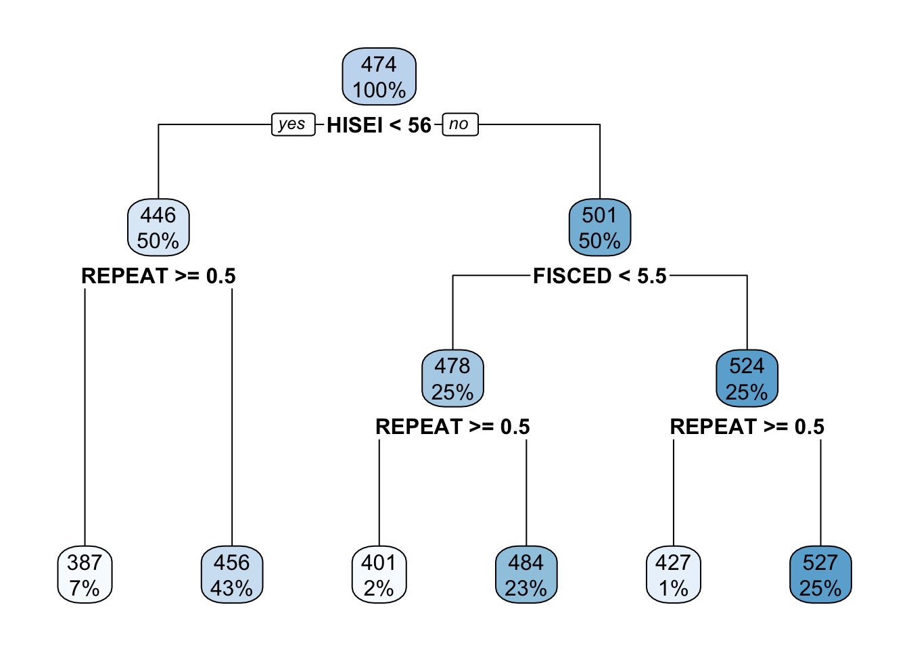

In this example the top-most box which says `HISEI < 56` is the **root node**. This is the most important variable that predicts `math_score`. Inside the blue box you can see two numbers: $100\%$ which means that the entire sample is present in this **node** and the number `474`, the average test score for mathematics for the entire sample:

On both sides of the root node (`HISEI < 56`) there is a `yes` and a `no`. Decision trees work by **partitioning** variables into `yes-or-no` branches. The `yes` branch satisfies the name of **root** (`HISEI < 56`) and always branches out to the left:

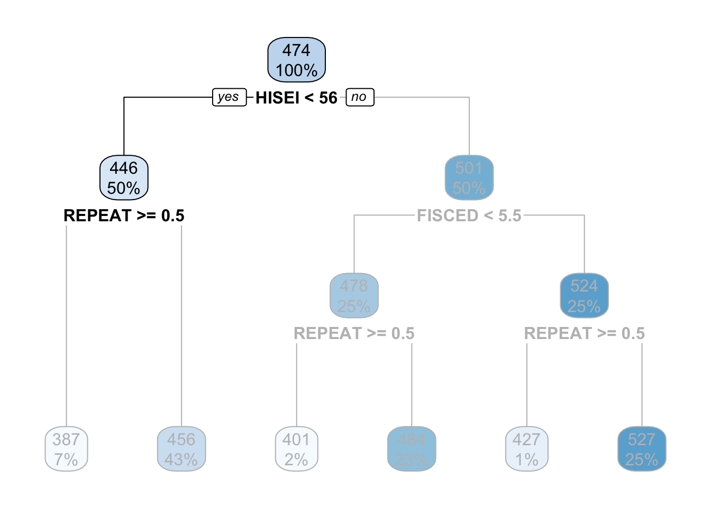

In contrast, the `no` branch always branches out to the right:

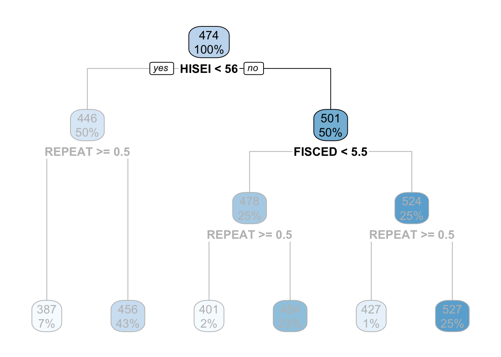

The criteria for separating into `yes-or-no` branches is that respondents must be very similar within branches and very different between branches (later in this chapter I will explain in detail which criteria is used and how). The decision tree figures out that respondents that have an `HISEI` below $56$ and above $56$ are the most different with respect to the mathematics score. The left branch (where there is a `yes` in the **root node**) are those which have a `HISEI` below 56 and the right branch (where there is a `no`) are those which have a `HISEI` above $56$. Let's call these two groups the low and high SES respectively. If we look at the two boxes that come down from these branches, the low SES branch has an average math score of $446$ while the high SES branch has an average test score of $501$:

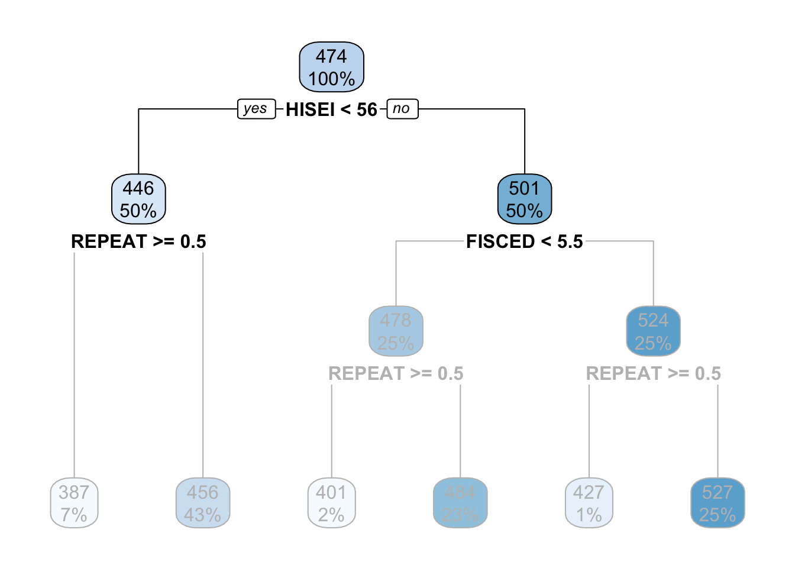

For the sake of simplicity, let's focus now on the branch of the low SES group (the left branch). The second node coming out of the low SES branch contains 50\% of the sample and an average math score of $446$. This is the node with the rule `REPEAT >= 0.5`:


This 'intermediate' node is called **internal node**. For calculating this **internal node**, the decision tree algorithm limits the entire data set to only those which have low SES (literally, the decision tree does something like `pisa[pisa$HISEI < 56, ]`) and asks the same question that it did in the **root node**: of all the variables in the model which one separates two branches such that respondents are very similar within the branch but very different between the branches with respect to `math_score`? 

For those with low SES background, this variable is whether the child repeated a grade or not. In particular, those coming from low SES background which repeated a grade, had an average math score of $387$ whereas those who didn't have an average math score of $456$:


These two nodes at the bottom are called **leaf nodes** because they are like the 'leafs of the tree'. **Leaf nodes**  are of particular importance because they are the ones that dictate what the final value of `math_score` will be. Any new data that is predicted with this model will always give an average `math_score` of $456$ for those of low SES background who didn't repeat a grade:

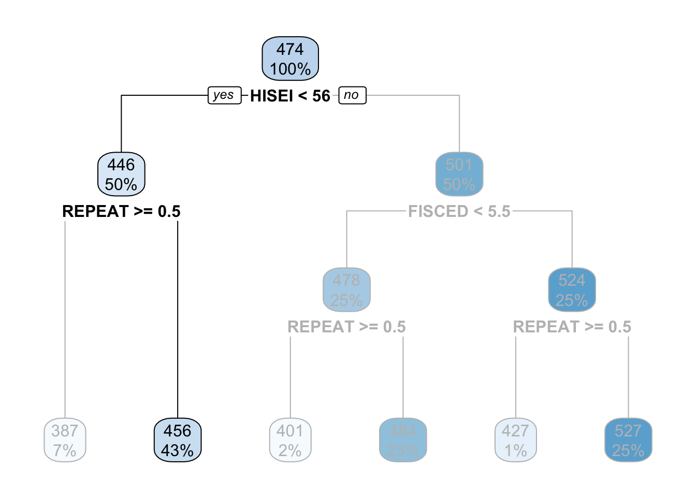

Similarly, any respondent from high SES background, with a highly educated father who didn't repeat a grade, will get assigned a `math_score` of $527$:


That is it. That is a decision tree in it's simplest form. It contains a **root node** and several **internal** and **leaf nodes** and it can be interpreted just as we just did. The right branch of the tree can be summarized with the same interpretation. For example, for high SES respondents, father's education (`FISCED`) is more important than `REPEAT` to separate between math scores:

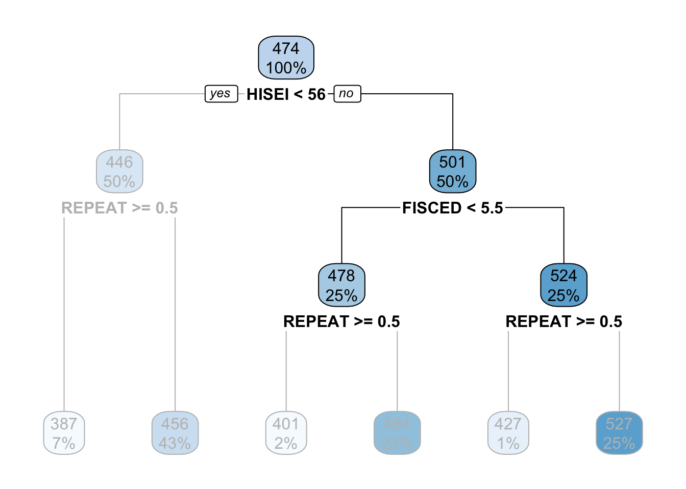

This is the case because it comes first in the tree. Substantially, this might be due to the fact that there is higher variation in education credentials for parents of high SES background than for those of low SES background. We can see that those with the highest father's education (`FISCED` above $5.5$), the average math score is $524$ whereas those with father's education below $5.5$ have a math score of $478$.

Did you notice that we haven't interpreted any coefficients? That's right. Decision trees have no coefficients and many other machine learning algorithms also don't produce coefficients. Although for the case of decision trees this is because the model produces information in another way (through the visualization of trees), lack of coefficients is common in machine learning models because they are too complex to generate coefficients for single predictors. These models are non-linear, non-parametric in nature, producing very complex relationships that are difficult to summarize as coefficients. Instead, they produce predictions. We'll be delving into this topic in future sections in detail.

These examples show that decision trees are a great tool for exploratory analysis and I strongly believe they have an inmense potential for exploring interactions in social science research. In case you didn't notice it, we literally just interpreted an interaction term that social scientists would routinely use in linear models. Without having to worry about statistical significance or plotting marginal effects, social scientists can use decision trees as an exploratory medium to understand interactions in an intuitive way. 

You might be asking yourself, how do we fit these models and visualize them? `tidyflow` and `tidymodels` have got you covered. For example, for fitting the model from above, we can begin our `tidyflow`, add a split, a formula and define the decision tree:


```r
# Define the decision tree and tell it the the dependent
# variable is continuous ('mode' = 'regression')
mod1 <- set_engine(decision_tree(mode = "regression"), "rpart")

tflow <-
  # Plug the data
  pisa %>%
  # Begin the tidyflow
  tidyflow(seed = 23151) %>%
  # Separate the data into training/testing
  plug_split(initial_split) %>%
  # Plug the formula
  plug_formula(math_score ~ FISCED + HISEI + REPEAT) %>%
  # Plug the model
  plug_model(mod1)

vanilla_fit <- fit(tflow)
tree <- pull_tflow_fit(vanilla_fit)$fit
rpart.plot(tree)
```


All `plug_*` functions serve to build your machine learning workflow and the model `decision_tree` serves to define the decision tree and all of the arguments. `rpart.plot` on the other hand, is a function used specifically for plotting decision trees (that is why we loaded the package `rpart.plot` at the beginning). No need to delve much into this function. It just works if you pass it a decision tree model: that is why `pull` the model fit before calling it.

I've told all the good things about decision trees but they have important disadvantages. There are two that we'll discuss in this chapter. The first one is that decision trees tend to overfit a lot. Just for the sake of exemplifying this, let's switch to another example. Let's say we're trying to understand which variables are related to whether teachers set goals in the classroom. Substantially, this example might not make a lot of sense, but but let's follow along just to show how much trees can overfit the data. This variable is named `ST102Q01TA`. Let's plug it into our `tidyflow` and visualize the tree:


```r
## ST100Q01TA
## ST102Q01TA
## IC009Q07NA
## ST011Q03TA
## ST011Q05TA
## ST011Q10TA

# We can recicle the entire `tflow` from above and just
# replace the formula:
tflow <-
  tflow %>%
  replace_formula(ST102Q01TA ~ .)

fit_complex <- fit(tflow)
tree <- pull_tflow_fit(fit_complex)$fit
rpart.plot(tree)
```


The tree is quite big compared to our previous example and makes the interpretation more difficult. However, equally important, some **leaf nodes** are very small. Decision trees can capture a lot of noise and mimic the data very closely. $6$ **leaf nodes** have less than $3\%$ of the sample. These are **leaf nodes** with very weak statistical power:

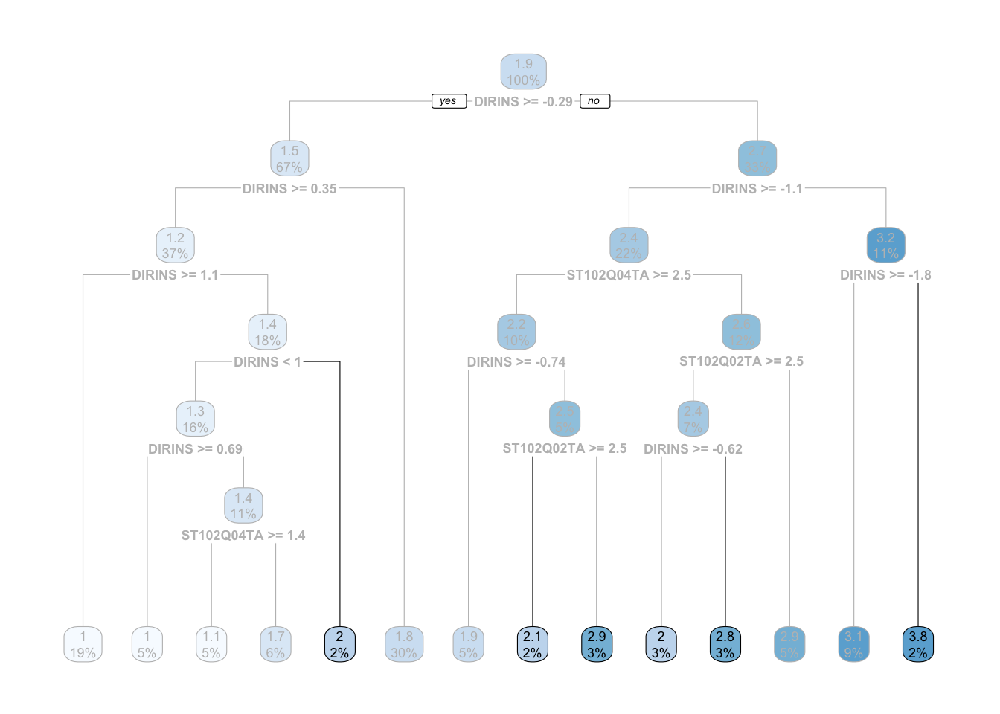

What would happen if a tiny $1\%$ of those **leaf nodes** respondend **slightly** different? It is possible we get a complete different tree. Decision trees are not well known for being robust. In fact, it is one of its main weaknesses. However, decision trees have an argument called `min_n` that force the tree to discard any **node** that has a number of observations below your specified minimum. Let's run the model above and set the minimum number of observation per **node** to be $200$:


```r
dectree <- update(mod1, min_n = 200)
tflow <-
  tflow %>%
  replace_model(dectree)

fit_complex <- fit(tflow)
tree <- pull_tflow_fit(fit_complex)$fit
rpart.plot(tree)
```

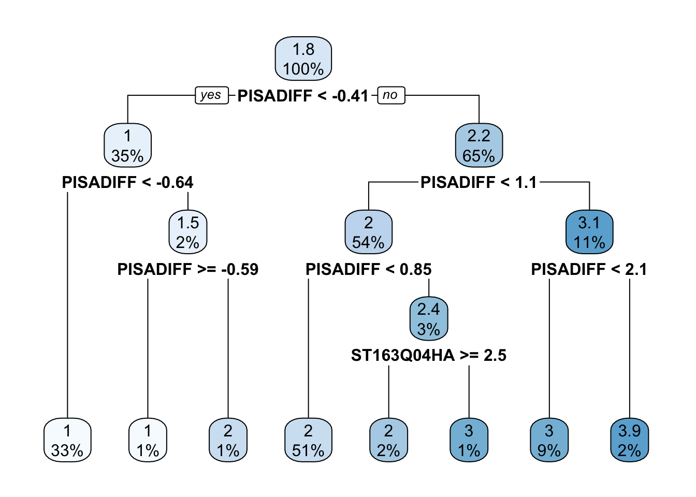

The tree was reduced considerably now. There are fewer **leaf nodes** and all nodes have a greater sample size than before. 

You might be wondering: what should the minimum sample size be? There is no easy answer for this. The rule of thumb should be relative to your data and research question. In particular, the identification of small nodes should be analyzed with care. Perhaps there **is** a group of outliers that consitute a node and it's not a problem of statistical noise. By increasing the minimum sample size for each node you would be destroying that statistical finding. 

For example, suppose we are studying welfare social expenditure as the dependent variable and then we had other independent variables, among which are country names. Scandinavian countries might group pretty well into a solitary node because they are super powers in welfare spending (these are Denmark, Norway, Sweden and Finland). If we increased the minimum sample size to $10$, we might group them with Germany and France, which are completely different in substantive terms. The best rule of thumb I can recommend is no other than to study your problem at hand with great care and make decisions accordingly. It might make sense to increase the sample or it might not depending on the research question, the sample size, whether you're exploring the data or whether you're interested in predicting on new data.

Despite `min_n` helping to make the tree more robust, there are still several nodes with low sample sizes. Another way to approach this problem is through the depth of the tree. As can be seen from the previous plot, decision trees can create **leaf nodes** which are very small. In other more complicated scenarios, your tree might get huge. Yes, huge:


More often that not, these huge trees are just overfitting the data. They are creating very small nodes that capture noise from the data and when you're predicting on new data, they perform terribly bad. As well as the `min_n` argument, decision trees have another argument called `tree_depth`. This argument forces the tree to stop growing if it passes the maximum depth of the tree as measured in nodes. Let's run our previous example with only a depth of three nodes:


```r
dectree <- update(mod1, min_n = 200, tree_depth = 3)
tflow <-
  tflow %>%
  replace_model(dectree)

fit_complex <- fit(tflow)
tree <- pull_tflow_fit(fit_complex)$fit
rpart.plot(tree)
```

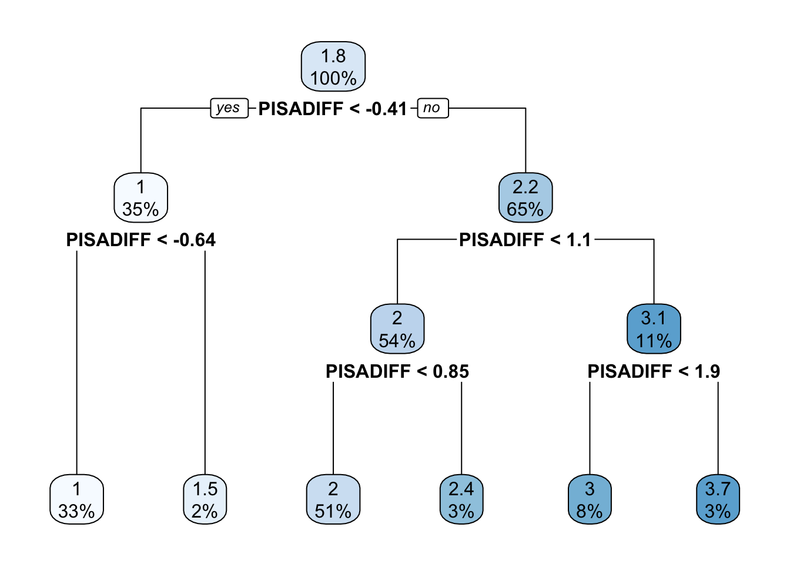

The tree was reduced considerably now in combination with the minimun number of respondents within each node. In fact, there is only one node that has a sample size lower than $3\%$. The `min_n` and  `tree_depth` can help you reduce the overfitting of your tree, but don't think these are easy fixes. Decision trees are simply to easy to overfit the data and as we'll see, there are more advanced tree methods that can help to fix this.

Note that we've been interpreting decision trees in a 'subjective' fashion. That is, we've been cutting the nodes of the trees from subjective criteria that makes sense to our research problem. This is how we social scientists would analyze the data. The tree should model our theoretical problem and make substantive sense. However, for machine learning, we have other criteria: how well it predicts. Let's check how our model predicts at this point:


```r
fit_complex %>%
  predict_training() %>%
  rmse(ST102Q01TA, .pred)
```

```
## # A tibble: 1 x 3
##   .metric .estimator .estimate
##   <chr>   <chr>          <dbl>
## 1 rmse    standard       0.514
```

Our predictions for each set goals is off by around $.5$ in a scale of $1$ through $4$. This is not terribly bad. For example, it means that for every child that answered a $2$, on average, we have an error of around $.5$. This means that any prediction for a single number runs the risk of being wrongly predicting either the number from above or below (a child with a $2$ might get a wrong prediction of $3$ or a $1$ but hardly a $4$). To improve prediction, we can allow `tidyflow` to search for the best combination of `min_n` and `tree_depth` that maximizes prediction. Let's perform a grid search for these two tuning values. However, let's set the range of tuning values ourselves:


```r
tune_mod <- update(dectree, min_n = tune(), tree_depth = tune())

tflow <-
  tflow %>%
  plug_resample(vfold_cv, v = 5) %>%
  plug_grid(
    expand.grid,
    tree_depth = c(1, 3, 9),
    min_n = c(50, 100)
  ) %>%
  replace_model(tune_mod)

fit_tuned <- fit(tflow)

fit_tuned %>%
  pull_tflow_fit_tuning() %>%
  show_best(metric = "rmse")
```

```
## # A tibble: 5 x 7
##   tree_depth min_n .metric .estimator  mean     n std_err
##        <dbl> <dbl> <chr>   <chr>      <dbl> <int>   <dbl>
## 1          9    50 rmse    standard   0.459     5  0.0126
## 2          9   100 rmse    standard   0.459     5  0.0126
## 3          3    50 rmse    standard   0.518     5  0.0116
## 4          3   100 rmse    standard   0.518     5  0.0116
## 5          1    50 rmse    standard   0.649     5  0.0102
```

It seems that our predictions on the training data were slightly overfitting the data, as the best error from the cross-validation search is centered around `0.459` with a standard error of `0.01`. Let's explore whether the error changes between the minimum sample size and the tree depth:


```r
tree_depth_lvl <- paste0("Tree depth: ", c(1, 3, 9))

fit_tuned %>%
  pull_tflow_fit_tuning() %>%
  collect_metrics() %>%
  mutate(ci_low = mean - (1.96 * std_err),
         ci_high = mean + (1.96 * std_err),
         tree_depth = factor(paste0("Tree depth: ", tree_depth), levels = tree_depth_lvl),
         min_n = factor(min_n, levels = c("50", "100"))) %>%
  filter(.metric == "rmse") %>% 
  ggplot(aes(min_n, mean)) +
  geom_point() +
  geom_errorbar(aes(ymin = ci_low, ymax = ci_high), width = .1) +
  scale_x_discrete("Minimum sample size per node") +
  scale_y_continuous("Average RMSE") +
  facet_wrap(~ tree_depth, nrow = 1) +
  theme_minimal()
```

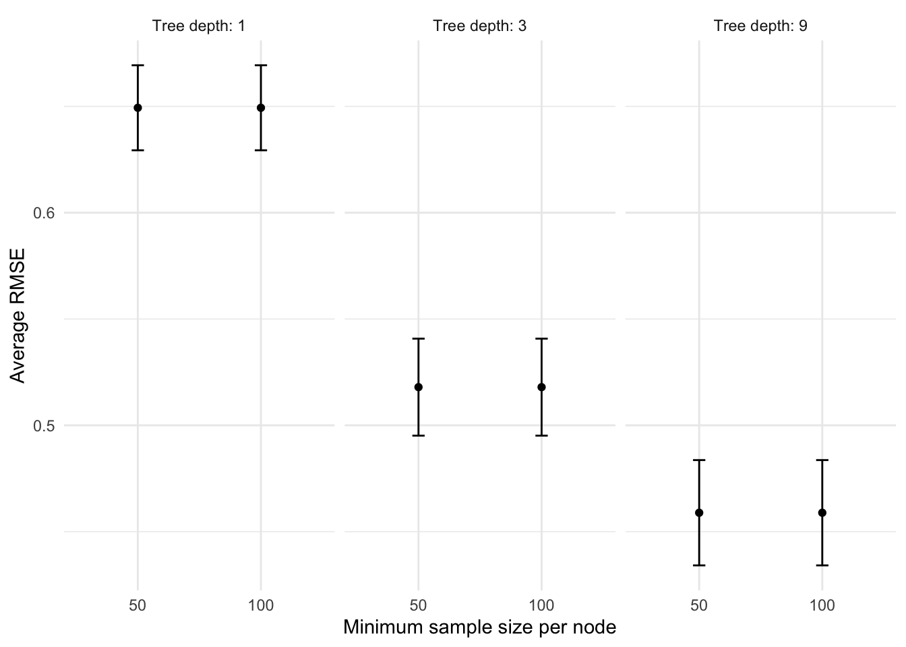

On the `x` axis we have the minimum sample size per node (these are the values for `min_n`) and on the `y` axis we have the error of the model through cross-validation (the $RMSE$). The lower each points is on the plot, the better, since it means that the error is lower. 

Let's begin with the first plot on the left. The points represent the error of the model with different sample sizes for the nodes with a fixed tree depth of $1$. For a tree depth of $1$, the error of the model is around `.65`. However, as the number of trees increases (the additional *plots* to the right), the error comes down to nearly `.47` when there is a `tree_depth` of 9. It seems that the simplest model with the lowest $RMSE$ has a `tree_depth` of 9 and a minimum sample size of 50. We calculated this ourselves for this example, but `complete_tflow` can calculate this for you:


```r
final_model <-
  fit_tuned %>%
  complete_tflow(metric = "rmse",
                 tree_depth,
                 method = "select_by_one_std_err")

train_err <-
  final_model %>%
  predict_training() %>%
  rmse(ST102Q01TA, .pred)

test_err <-
  final_model %>%
  predict_testing() %>%
  rmse(ST102Q01TA, .pred)

c("testing error" = test_err$.estimate, "training error" = train_err$.estimate)
```

```
##  testing error training error 
##      0.4644939      0.4512248
```

Our testing error and our training error have a difference of only $0.01$, not bad. The cross-validation tuning seemed to have helped avoid a great deal of overfitting.

Before we go through the next section, I want to briefly mention an alternative to `tree_depth` and `min_n`. A technique called 'tree pruning' is also very common for modeling decision trees. It first grows a very large and complex tree and **then** starts pruning the leafs. This technique is also very useful but due to the lack of time, we won't cover this in the course. You can check out the material on this technique from the resources outlined in the first paragraph of this section.

### Advanced: how do trees choose where to split?

Throughout most of the chapter we've seen that trees find optimal 'splits' that make the respondents very different between the splits and very similar within them. But how do decision trees make these splits? Let's work out a simple example using the `HISEI` variable from the first model in this section.


`HISEI` is an index for the socio-economic status of families. It's continuous and has a distribution like this:


As we saw in the first tree of this section, `HISEI` is the **root node**. To decide on the **root node**, the decision tree algorithm chooses a random location in the distribution of `HISEI` and draws a split:

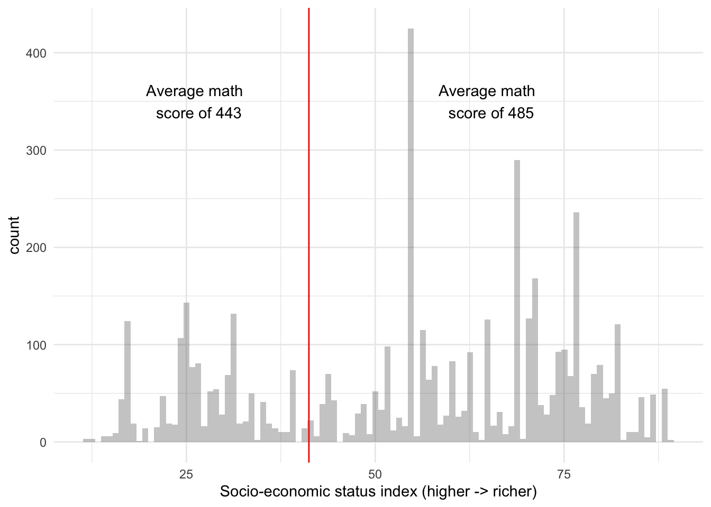

The two sides have an average `math_score` which serves as the baseline for how different these two groups are. At this point, the algorithm does something very simple: for each split, it calculates the **R**esidual **S**um of **S**quares (RSS). This is just the sum of the `math_score` of each respondent ($math_i$) minus the average `math_score` ($\hat{math}$) for that split squared. In other words, it applies the $RSS$ for each split:

\begin{equation}
RSS = \sum_{k = 1}^n(math_i - \hat{math})^2
\end{equation}

Each side of the split then has a corresponding $RSS$:


After that, it calculates the total $RSS$ of the split by adding the two $RSS$:


So far we should have a single random split with an associated $RSS$ for $HISEI$. The decision tree algorithm is called *recursive binary splitting* because it is recursive: it repeats itself again many times. It repeats the strategy of $Split$ -> $RSS_{split}$ -> $RSS_{total}$ many times such that we get a distribution of splits and $RSS$ for $HISEI$:

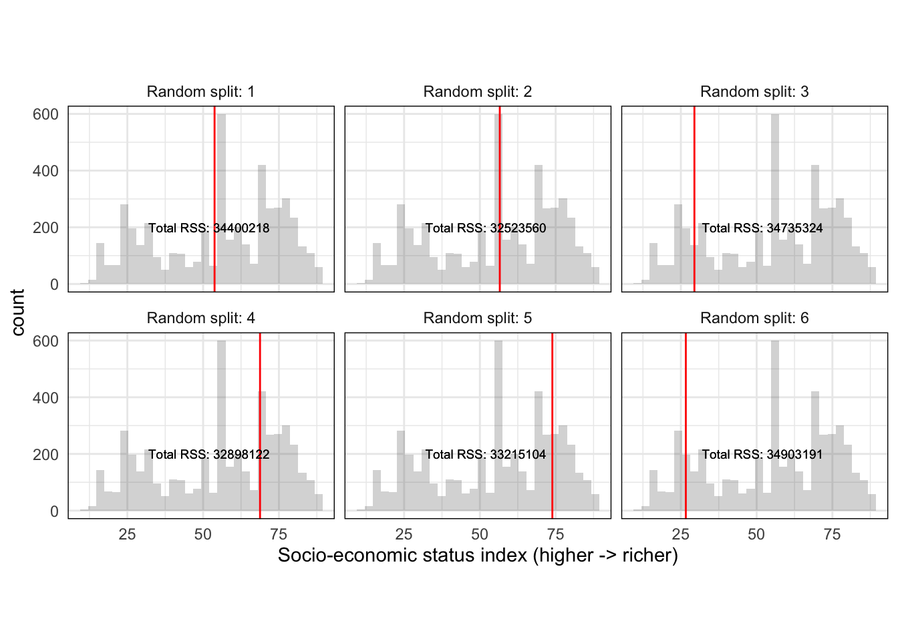

This produces a distribution of random splits with an associated metric of fit ($RSS$) for $HISEI$. *Recursive binary splitting* applies this same logic to every single variable in the model such that you have a distribution of splits for every single variable:


```
## # A tibble: 8 x 3
##   variable random_split total_rss            
##   <chr>    <chr>        <chr>                
## 1 "HISEI"  41.22        "Total RSS: 34423362"
## 2 "HISEI"  53.77        "Total RSS: 34400218"
## 3 "HISEI"  56.57        "Total RSS: 32523560"
## 4 ""       ...          ""                   
## 5 "FISCED" 2            "Total RSS: 35901660"
## 6 "FISCED" 1            "Total RSS: 36085201"
## 7 "FISCED" 5            "Total RSS: 34083264"
## 8 ""       ...          ""
```

With such a distribution, the algorithm can objectively ask: which random split best separates the data into two branches with the lowest $RSS$? And based on that answer, the first **node** is chosen. After this first node is chosen, two branches grow to both sides. The algorithm then applies exactly the same set of rules *recursively* for each branch until a maximum depth is reached.

Although this explanation will be in nearly all cases invisible to you, this intuition can help you understand better which criteria is used for choosing a split. For example, understanding how this splitting is done gives you insight into how outliers do not affect the selection of splits because the splitting criteria is random and navigates the entire distribution. 

In addition, there might be cases where you might want to switch the $RSS$ for another loss function because it makes sense for your problem. For example, using decision trees with binary dependent variables merits another type of loss function: *Gini impurity*. We won't delve into this but it serves as an example that these are things which are not fixed. These are decision that depend on your research problem and it might make sense to experiment with them if needed.

## Bagging

The problem with decision trees is that even if you work really hard to avoid overfitting, they can be very susceptible to the exact format of the data. For some cases, you might even get completely different trees every time you run your model. Quite literally, running the same model might offer very different trees if some part of the sample changes. This small simluation predicts `math_score` on all variables in the `pisa` data set but samples different percentages of the whole sample:


This drastic differences between trees is because decision trees have a lot of variance and very little bias. They learn the current data very well (little bias) but if you generalize them to new data, they can perform very badly (a lot of variance). This is where bagging, or **B**ootstrap **Agg**regation comes in.

Before we explain what bagging is all about, let's spend a minute explaining what bootstrapping is. Let's work out a manual example and limit our `pisa` dataset to only five rows, keep a few selected columns and add a unique id for each row:


```r
sel_cols <- c("math_score", "HISEI", "REPEAT", "IMMIG", "read_score")
pisa_small <- pisa[1:5, sel_cols]
pisa_small$id <- 1:5
pisa_small
```

```
##   math_score HISEI REPEAT IMMIG read_score id
## 1   512.7125 28.60      0     1   544.2085  1
## 2   427.3615 59.89      0     1   432.2518  2
## 3   449.9545 39.02      0     1   503.9496  3
## 4   474.5553 26.60      0     1   437.7777  4
## 5   469.1545 76.65      0     1   535.9487  5
```

Bootstraping is a statistical technique where you resample your data to such that some rows are randomly duplicated. We can do this manually in R:


```r
# Sample from the number of rows in `pisa_small`
# and allow certain numbers to be replaced.
set.seed(23551)
row_index <- sample(nrow(pisa_small), replace = TRUE)
pisa_small[row_index, ]
```

```
##     math_score HISEI REPEAT IMMIG read_score id
## 1     512.7125 28.60      0     1   544.2085  1
## 4     474.5553 26.60      0     1   437.7777  4
## 4.1   474.5553 26.60      0     1   437.7777  4
## 3     449.9545 39.02      0     1   503.9496  3
## 5     469.1545 76.65      0     1   535.9487  5
```

We randomly sampled the same number of rows and got the respondent number four repeated twice. We can run this many times and get many **resamples** of our data:


```r
lapply(1:2, function(x) {
  row_index <- sample(nrow(pisa_small), replace = TRUE)
  pisa_small[row_index, ]
})
```

```
## [[1]]
##     math_score HISEI REPEAT IMMIG read_score id
## 3     449.9545 39.02      0     1   503.9496  3
## 5     469.1545 76.65      0     1   535.9487  5
## 3.1   449.9545 39.02      0     1   503.9496  3
## 1     512.7125 28.60      0     1   544.2085  1
## 3.2   449.9545 39.02      0     1   503.9496  3
## 
## [[2]]
##     math_score HISEI REPEAT IMMIG read_score id
## 1     512.7125  28.6      0     1   544.2085  1
## 4     474.5553  26.6      0     1   437.7777  4
## 4.1   474.5553  26.6      0     1   437.7777  4
## 4.2   474.5553  26.6      0     1   437.7777  4
## 4.3   474.5553  26.6      0     1   437.7777  4
```

Since the number of rows that we sample is random, in some instances we might the same row repeated 10 times, in others only 1 time and other even 0 times! This is what bootstrapping is all about. If we run $10$ bootstraps, it just means we got the same 10 datasets but with some rows repeated many times and others randomly removed. 

Bootstrapping is mainly used to calculate statistics such as standard errors and standard deviations because it has very nice properties to estimate uncertainty in situations where its impossible to calculate it. However, it also has advantages for reducing the variance in models such as decision trees. 

Let's get back to how bagging works. Bagging works by bootstraping your data $N$ times and fitting $N$ decision trees. Each of these decision trees has a lot of variance because we allow the tree to overfit the data. The trick with bagging is that we **average** over the predictions of all the $N$ decision trees, improving the high variability of each single decision tree. 

In the same spirit as before, let's work out a manual example just so you can truly grasp that intuition. However, don't worry, there are functions inside `tidymodels` and `tidyflow` that will perform all of this for you. 

Let's adapt the code from above to use the original `pisa` data, sample only 60\% of the data in each bootstrap and generate 20 copies of our data with random picks of rows in each iteration:


```r
pisa$id <- 1:nrow(pisa)
bootstrap_pisa <-
  lapply(1:20, function(x) {
    row_index <- sample(nrow(pisa) * .6, replace = TRUE)
    pisa[row_index, ]
  })
```

The result is named `bootstrap_pisa` and is list with 20 data frames. You can inspect the first two  with `bootstrap_pisa[[1]]` and `bootstrap_pisa[[2]]`. Inside each of these, there should be a data frame with 60\% of the original number of rows of the `pisa` data where each row was randomly picked. Some of these might be repeated many times, other might just be there once and others might not even be there.

Let's now loop over these 20 datasets, fit a decision tree to each one and predict on the original `pisa` data. The result of this loop should be 20 data frames each with a prediction for every respondent:


```r
tflow <-
  tidyflow() %>%
  plug_formula(math_score ~ .) %>%
  plug_model(decision_tree(mode = "regression") %>% set_engine("rpart"))

all_pred_models <-
  lapply(bootstrap_pisa, function(x) {
    small_model <-
      tflow %>%
      plug_data(x) %>%
      fit()

    cbind(
      pisa["id"],
      predict(small_model, new_data = pisa)
    )
  })
```

The first slot contains predictions for all respondents. Let's look confirm that:


```r
head(all_pred_models[[1]])
```

```
##   id    .pred
## 1  1 493.6071
## 2  2 378.5172
## 3  3 440.5835
## 4  4 440.5835
## 5  5 493.6071
## 6  6 440.5835
```

Let's confirm the same thing for the second slot:


```r
head(all_pred_models[[2]])
```

```
##   id    .pred
## 1  1 486.7747
## 2  2 432.6909
## 3  3 432.6909
## 4  4 432.6909
## 5  5 486.7747
## 6  6 486.7747
```

The second slot also contains predictions for all respondents but they are different from the first one because they are based on a random sample. This same logic is repeated 20 times such that every respondent has 20 predictions. The trick behind bagging is that it **averages** the prediction of each respondent over the 20 bootstraps. 

This averaging has two advantages. First, it allows each single tree to grow as much as possible, allowing it to have a lot of variance and little bias. This has a good property which is little bias but a negative aspect, which is a lot of variance. Bagging compensates this high level of variance by averaging the predictions of all the small trees:


```r
# Combine all the 20 predictions into one data frame
all_combined <- all_pred_models[[1]]
for (i in seq_along(all_pred_models)[-1]) {
  all_combined <- cbind(all_combined, all_pred_models[[i]][-1])
}

# Average over the 20 predictions
res <- data.frame(id = all_combined[1], final_pred = rowMeans(all_combined[-1]))

head(res)
```

```
##   id final_pred
## 1  1   494.1934
## 2  2   403.6330
## 3  3   436.1936
## 4  4   443.5922
## 5  5   491.6506
## 6  6   457.9670
```

We get a final prediction for each respondent. If we wanted to, we could calculate the standard deviation of these 20 predictions for each respondent and generate uncertainty intervals around each respondent's predictions. More often than not, this is a good idea.

In the previous example we used 20 bootstraps for the sake of simplicity but generally speaking as the number of trees increases, the less variance we will have in the final prediction and thus a stronger prediction. We can see more clearly the power of combining many trees with the simulation below:


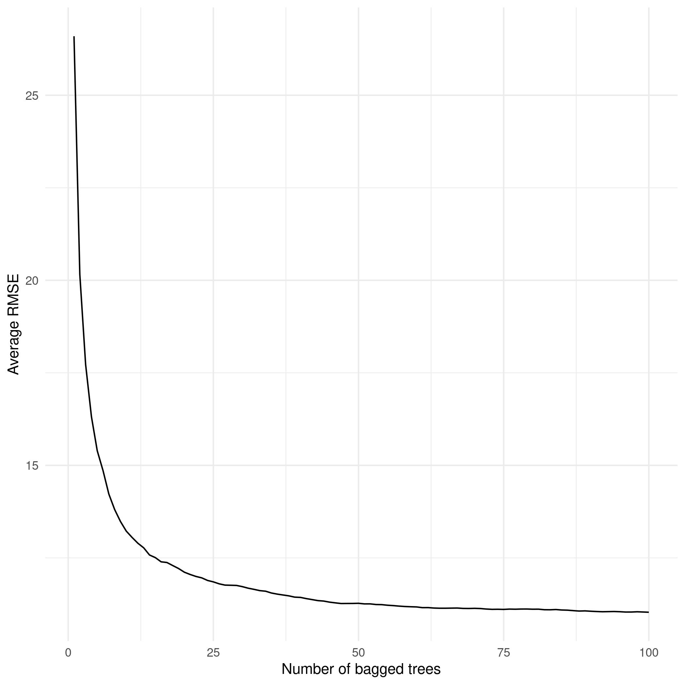

The `x` axis shows the number of bootstraps (or fitted trees, it's the same) and the `y` axis shows the average $RMSE$ in `math_score` for each of these bagged trees. As we increase the number of small trees (or bootstraps, it's the same), there is a substantial reduction in the error rate of `math_score`. This is an impressive reduction relative to our initial decision tree.

Having seen the power of increasing the number of trees, how many trees should your model use? For models which exhibit reasonable levels of variability (like our `math_score` example), $100$-$200$ bootstraps is often enough to stabilize the error in the predictions. However, very unstable models might require up to $500$. 

Let's fit the same model we implemented manually above using `tidymodels` and `tidyflow`. Bagged trees can be implemented with the function `bag_tree` from the package `baguette`. With this package we can control the number of bootstraps with the argument `times`. We can define our model as usual using `tidyflow`:


```r
btree <- bag_tree(mode = "regression") %>% set_engine("rpart", times = 50)

tflow <-
  pisa %>%
  tidyflow(seed = 566521) %>%
  plug_split(initial_split) %>% 
  plug_formula(math_score ~ .) %>%
  plug_model(btree)

tflow
```

```
## ══ Tidyflow ════════════════════════════════════════════════════════════════════
## Data: 4.84K rows x 502 columns
## Split: initial_split w/ default args
## Formula: math_score ~ .
## Resample: None
## Grid: None
## Model:
## Bagged Decision Tree Model Specification (regression)
## 
## Main Arguments:
##   cost_complexity = 0
##   min_n = 2
## 
## Engine-Specific Arguments:
##   times = 50
## 
## Computational engine: rpart
```

You might be asking yourself, why don't we define `bootstraps` inside `plug_resample`? After all,`bootstraps` **is** a resampling technique. We could do that but it doesn't make sense in this context. `plug_resample` is aimed more towards doing grid search of tuning values together with `plug_grid`. Since `bag_trees` is not performing any type grid search but rather fitting a model many times and making predictions, it automatically incorporates this procedure inside `bag_trees`. If instead we were doing a grid search of let's say, `min_n` and `tree_depth` for `bag_tree`, using `plug_resample` with `boostraps` would be perfectly reasonable.

Let's fit both a simple decision tree and the bagged decision tree, predict on the training set and record the average $RMSE$ for both:


```r
res_btree <- tflow %>% fit()
res_dtree <- tflow %>% replace_model(decision_tree() %>% set_engine("rpart")) %>% fit()

rmse_dtree <-
  res_dtree %>%
  predict_training() %>%
  rmse(math_score, .pred)

rmse_btree <-
  res_btree %>%
  predict_training() %>%
  rmse(math_score, .pred)

c("Decision tree" = rmse_dtree$.estimate, "Bagged decision tree" = rmse_btree$.estimate)
```

```
##        Decision tree Bagged decision tree 
##             33.85131             11.33018
```

The bagged decision tree improves the error rate from $33$ math test points to $11$. That is a $66\%$ reduction in the error rate! That is an impressive improvement for such a simple extension of decision trees.

As all other models, bagging also has limitations. First, although bagged decision trees offer improved predictions over decision trees, they do this at the expense of interpretability. Unfortunately, there is no equivalent of an 'average' tree that we can visualize. Remember, we have $100$ predictions from $100$ different trees. It is not possible nor advisable to visualize $100$ trees. Instead, we can look at the average variable importance. Bagging offers the 'contribution' of each variable using loss functions. For continuous variables, it uses the $RSS$ (which we have described and used throughout this chapter) and for binary variables it uses the Gini index. We can look at the importance of the variables to get a notion of which variables are the important ones for good prediction:


```r
res_btree %>%
  pull_tflow_fit() %>%
  .[['fit']] %>%
  var_imp()
```

```
## # A tibble: 501 x 4
##    term           value std.error  used
##    <chr>          <dbl>     <dbl> <int>
##  1 scie_score 23363949.    75426.    50
##  2 read_score 17033482.    69939.    50
##  3 ST166Q03HA  5913918.    66479.    50
##  4 METASPAM    5671665.    68871.    50
##  5 IC152Q08HA  3850699.   304274.    49
##  6 PISADIFF    3046729.   362250.    50
##  7 IC010Q06NA  2691482.   355147.    50
##  8 ST013Q01TA   433681.   142604.    50
##  9 ESCS         329367.    16981.    50
## 10 HOMEPOS      258437.    11440.    50
## # … with 491 more rows
```

Secondly, bagging might seem like a deal breaker for **any** type of model (you can apply it to any type of model such as logistic regression, regularized regression, etc..) but it works well only for models which are very unstable. For example, linear regression and logistic regression are very robust models. With enough sample size, running a bagged linear regression should return very similar estimates as a single fitted model. 

## Exercises

Explain that you have not performed any grid search for bagged trees but that they have to do it themselves.
