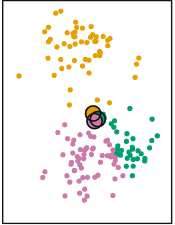
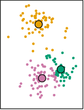

# Unsupervised methods

```{r, echo = FALSE}
options(scipen = 9999)
knitr::opts_chunk$set(warning = FALSE, message = FALSE)
```

Unsupervised learning is a very popular concept in machine learning. Although we social scientists are aware of some of these methods, we do not take advantage of them as much as machine learning practitioners. What is unsupervised learning? Let's get that out of the way: this just means that a particular statistical method **does not have a dependent variable**. These are models that look to find relationships between independent variables without the need of a dependent variable.

One common unsupervised method that social scientists are aware of is the **P**rincipal **C**omponent **A**nalysis or $PCA$. $PCA$ aims to summarize many variables into a small subset of variables that can capture the greatest variance out of all the main variables. We really never thought about this as an 'unsupervised' method, but it is used widely for predictive tasks. Before we begin, let's load the packages and data we'll be using.

```{r}
library(tidymodels)
library(tidyflow)
library(ggfortify)

data_link <- "https://raw.githubusercontent.com/cimentadaj/ml_socsci/master/data/pisa_us_2018.csv"
pisa <- read.csv(data_link)
```

Most of the material on this chapter was built upon @boehmke2019 and @james2013. In particular, the section on K-Means clustering contains images directly copied from @james2013.

## Principal Component Analysis (PCA)

**P**rincipal **C**omponent **A**nalysis or $PCA$ is a method that tries to summarize many columns into a very small subset that captures the greatest variability of the original columns. Social Scientists often use this method to create more 'parsimonious' models and summarize many variables into a few 'strong' variables.

$PCA$ works by creating several components which are the normalized linear combination of the variables in the model. In the `pisa` data there are a six variables which asks the student whether they've suffered negative behavior from their friends in the past 12 months. In particular, it asks whether

* Other students left them out of things on purpose
* Other students made fun of them
* They were threatened by other students
* Other students took away or destroyed things that belonged to them
* They got hit or pushed around by other students
* Other students spread nasty rumors about them

For each of these variables, the scale ranges from 1 to 4 where 4 is 'Once a week or more' and 1 is 'Never or almost never'. In other words, the higher the number, the more negative their response.

Let's rename these variables into more interpretable names and look at their correlation:

```{r}
pisa <-
  pisa %>%
  rename(
    past12_left_out = ST038Q03NA,
    past12_madefun_of_me = ST038Q04NA,
    past12_threatened = ST038Q05NA,
    past12_destroyed_personal = ST038Q06NA,
    past12_got_hit = ST038Q07NA,
    past12_spread_rumours = ST038Q08NA
  )

pisa_selected <-
  pisa %>% 
  select(starts_with("past12"))

cor(pisa_selected)
```

Most correlations lie between `0.4` and `0.6`, a somewhat acceptable threshold for assessing whether they can be reduced into fewer variables. $PCA$ works by receiving as input $P$ variables (in this case six) and calculating the normalized linear combination of the $P$ variables. This new variable is the linear combination of the six variables that captures the greatest variance out of all of them. $PCA$ continues to calculate other normalized linear combinations **but** with the constraint that they need to be completely uncorrelated to all the other normalized linear combinations.

This approach has the advantage that it constructs as many principal components (new variables) as it can, as long as they all capture 100\% of the variability of the original $P$ variables, and each of these new variables are completely uncorrelated between each other. 

Each variable is assessed by how much variance it explains of the original $P$ variables and each new variable is completely independent of the others. Depending on the correlation of the $P$ input variables, you might get three principal components that capture all of the variability of the original $P$ variables. In other cases, you can get an you might many more. 

This discussion is getting too theoretical. Let's get get some hands-on experience of how this works. Let's pass in our six variables to the function `prcomp`, which estimates these principal components based on our six variables. However, for $PCA$ to work well, we need to center and scale the independent variables. This means that the independent variables will have a mean of zero and a standard deviation of one. `prcomp` does this for you, but you should be aware of this for future discussion:

```{r}
pc <- prcomp(pisa_selected)
all_pcs <- as.data.frame(pc$x)
head(all_pcs)
```

Let's explain what just happened. Our dataset `pisa_selected` contains the six variables of interest. We passed that to `prcomp` which calculated the principal components. With this model object, we extracted the dataframe with the new principal components. The result of all of this is a dataframe with six new columns. These six new columns are **not** the initial six variables from `pisa_selected`. Instead, they are variables that summarize the relationship of these six variables. 

You might ask yourself, how come six variables **summarize** six variables? That doesn't make much sense. The whole idea is that fewer variables can summarize the original six. Let's look at how much variance of the original $P$ variables these 'index' variables explain:

```{r}
tidy(pc, "pcs")
```

This output shows how well each principal component is explaining the original six variables. For example, the first principal component (1st row) explains about 59\% of the variance of the six variables. The second principal component explains an additional 13.5\%, for a total of 72.6\% between the two. This is certainly better. It means that the first two variables seem to have some power in summarizing the original six variables.

Let's focus on the first two principal components. They are supposed to be completely uncorrelated, so let's check that ourselves:

```{r}
cor(all_pcs[c("PC1", "PC2")])
```

As expected, the correlation between these two variables is 0. 

How do we use these two variables? Well, a typical social scientist would make sure that their expected explanatory power of the two components is high enough for their research problem. If it is, they would include these two columns in their statistical models instead of the six variables. 
However, $PCA$ is all about exploratory data analysis. We might want to go further and explore how the original six variables are related to these principal components. These two principal components are a bit of a black box at this point. Which variables do they represent? We can check that with the initial output of `prcomp`:

```{r}
pc$rotation[, 1:2]
```

These two columns show the correlations between the six original variables and the first two principal components. Let's focus on the first column. The first thing that stands out is that for all the six variables, the correlation is negative. This means that as the respondents answered negatively to the six questions, the first principal component decreases. Informally, we could call this variable a 'negative-peer index'.

Moving to the second column, four of these six variables correlate positively with the second principal component. At least for these four variables, the principal components tend capture the exact opposite relationship. In other words, at least for these four variables, this is a 'positive-peer index'. This type of decomposition is precisely where the usefulness of this type of method comes in. It allows us to summarize many variables into a small set of components that capture meaningful variation.

The package `ggfortifty` contains the function `autoplot` which can help us visualize these correlations in a more meaningful way:

```{r}
set.seed(6652)
pc %>% 
  autoplot(loadings = TRUE,
           loadings.label = TRUE,
           loadings.label.repel = TRUE,
           alpha = 1/6) +
  theme_minimal()
```

Let's distill this plot. On the `X` axis we have the actual column of the first principal component (PC1) (this is literally the same column we saw in the object `all_pcs`; if it serves to refresh your memory, check it out with `head(all_pcs)`). As you can see, the label of the `X` axis already tells us that this component explains nearly 60\% of the variance of these six variables. On the `Y` axis we have the actual column of the second principal component (PC2) (same as before, you can see this with `head(all_pcs)`). This principal component explains an additional 13.5\% of the variance of the six variables. 

What this plot is trying to show is where these six variables are clustered between these two principal components. Since these two variables were centered and scaled to have a mean of zero, the red lines always begin at the intersection of the zero in PC1 and PC2. In other words, we can see more clearly the correlations we saw earlier. For example, remember that the first two variables were both negatively correlated with both PC1 and PC2. These two variables are located in the bottom left of the plot, showing that for both principal components both variables are associated with lower values of PC1 and PC2:

```{r, echo = FALSE}
set.seed(6652)
pc %>% 
  autoplot(loadings = TRUE,
           loadings.label = TRUE,
           loadings.label.repel = TRUE,
           alpha = 1/6) +
  annotate(geom = "rect",
           xmin = -0.07,
           xmax = -0.03,
           ymin = -0.057,
           ymax = -0.03,
           fill = "black",
           alpha = 0.1) +
  theme_minimal()
```

There is nothing new here. This is the same thing we interpreted from the correlation but from a more intuitive visualization. If you remember the other four variables from the correlation, they showed negative correlations with PC1 and positive correlations with PC2. This means that these variables should cluster **below** the average of PC1 and **higher** than the average of PC2. We can see that more clearly if we first add a line showing the zero values for both variables:

```{r, echo = FALSE}
set.seed(6652)
pc %>% 
  autoplot(loadings = TRUE,
           loadings.label = TRUE,
           loadings.label.repel = TRUE,
           alpha = 1/6) +
  geom_vline(xintercept = 0, alpha = 1/3, color = "red") +
  geom_hline(yintercept = 0, alpha = 1/3, color = "red") +
  theme_minimal()
```

Any values to the **left** of the the vertical line are low values of PC1 while all values **above** the horizontal line are high values for PC2. Building on this intuition, we should find that the remaining four variables cluster at lower values of PC1 and at higher values of PC1:

```{r, echo = FALSE}
set.seed(6652)
pc %>% 
  autoplot(loadings = TRUE,
           loadings.label = TRUE,
           loadings.label.repel = TRUE,
           alpha = 1/6) +
  geom_vline(xintercept = 0, alpha = 1/3, color = "red") +
  geom_hline(yintercept = 0, alpha = 1/3, color = "red") +
  annotate(geom = "rect",
           xmin = -0.06,
           xmax = -0.005,
           ymin = 0.02,
           ymax = 0.045,
           fill = "black",
           alpha = 0.1) +
  theme_minimal()
```

Depending on these correlations, you might reject to focus on the first two principal components and explore this same plot for PC1 and PC3 or PC2 and PC4. There's no clear cut rule for the number of principal components to use. The user should instead explore these plots to understand whether there are interesting findings from clustering many variables into fewer variables. Depending on this, you might reject the idea entirely of using principal components. Or you might use these principal components to represent some interesting findings for your theoretical model.

In any case, this method is inherently exploratory. It serves as way to understand whether we can reduce correlated variables into a small subset of variables that represent them. For a social science point of view, this method is often used for reducing the number of variables. However, there is still room for using it as a clustering method to understand whether certain variables can help us summarize our understanding into simpler concepts.

Having said this, for predictive tasks there is an objective measure on how many principal components to use: the ones that improve predictions the most. Using our previous example, we could perform a grid search on a number of components to see which one maximizes predictive accuracy. Let's run a random forest by regressing the variable `math_score` on all variables in the dataset. While we do that, let's try models with different number of principal components:

```{r}
# Set the number of components `num_comp`
# to be tuned
rcp <-
  ~ recipe(.x, math_score ~ .) %>%
    step_pca(starts_with("past12_"), num_comp = tune())

tflow <-
  pisa %>%
  tidyflow(seed = 25131) %>%
  plug_split(initial_split) %>%
  plug_recipe(rcp) %>%
  plug_model(set_engine(rand_forest(mode = "regression"), "ranger")) %>%
  plug_resample(vfold_cv) %>%
  # Set `num_comp`in the grid to 1:3
  # meaning that we'll try the models with
  # number of components 1, 2 and 3
  plug_grid(expand.grid, num_comp = 1:3)

res_rf <- fit(tflow)

res_rf %>%
  pull_tflow_fit_tuning() %>%
  collect_metrics() %>%
  filter(.metric == "rmse")
```

These are the average results of running a 10-fold cross-validation trying out models with one, two and three principal components respectively. As we can see from the `mean` column, there is little difference between the average $RMSE$ of these different models. If there are important reasons to include these variables in the model and we want to reduce the number of variables in the model for simplicity, we could just keep the model with one principal component. 

However, there's also an alternative approach. `step_pca` allows you to specify the minimum explanatory power of the principal components. As discussed in the documentation of `step_pca`, *you specify the fraction of the total variance that should be covered by the components. For example, `threshold = .75` means that `step_pca` should generate enough components to capture 75\% of the variance.*

We can try our previous models with a 90\% threshold. Since we will not perform a grid search, we will drop the grid and only keep the cross-validation to get uncertain estimates of our loss function $RMSE$:

```{r}
# Define a new recipe
# where threshold is .90
rcp <-
  ~ recipe(.x, math_score ~ .) %>%
    step_pca(starts_with("past12_"), threshold = .90)

# Replace the previous recipe
# and drop the grid
tflow <-
  tflow %>%
  replace_recipe(rcp) %>%
  drop_grid()

res_rf <- fit(tflow)

res_cv <-
  res_rf %>%
  pull_tflow_fit_tuning() %>%
  collect_metrics()

res_cv
```

This approach offers a very similar $RMSE$ of `r round(res_cv$mean[1], 2)`. Although not possible at this moment, `tidymodels` is expected to allow the `threshold` parameter to be `tune` such that you can perform a grid search of this value as well (for those interested, see [here](https://github.com/tidymodels/recipes/issues/534)).

Although $PCA$ is a very useful method for summarizing information, it is based on the notion that the variables to be summarized are best summarized through a linear combination. In other instances, non-linear methods can also prove useful as exploratory means.

## K-Means Clustering

K-Means is a method for finding clusters in a dataset of $P$ variables. It is somewhat different from $PCA$ because it attempts to find non-overlapping clusters of respondents using $P$ variables. In terms of interpretation and transparency, K-Means clustering is particularly useful for exploration in the social sciences.

Suppose we have a scatterplot of two variables:

```{r, echo = FALSE, out.width = "30%", fig.align = 'center'}
knitr::include_graphics("./img/km1.png")
```

The distribution of this scatterplot shows that there are at least two visible clusters, one in the top part of the plot and one in the bottom part of plot. How does K-Means identify clusters appropriately? First, it begins by **randomly** assigning each point a cluster. Let's suppose we want to identify three clusters:

```{r, echo = FALSE, out.width = "30%", fig.align = 'center'}
knitr::include_graphics("./img/km2.png")
```

Each point has now an associated color. However, these colors were randomly assigned. There's no evident pattern from the colors and the position of each point. K-Means clustering works by creating something called 'centroids' which represent the center of the different clusters. 

The centroid is usually the **mean of the $P$ variables**. For our simplified case, we calculate the average of X and Y for the color orange, then the average of X and Y for the color purple and then the average of X and Y for the color green. The end result of this is an average mean of X and Y for the three colors. For example, for the orange points, we can plot a 'average big point' that is located at the average of X and the average of Y **only** for the orange points. We repeat this for every color and plot it: 

```{r, echo = FALSE, out.width = "30%", fig.align = 'center'}
knitr::include_graphics("./img/km3.png")
```

Remember that we assigned the cluster colors to the points randomly? Then the mean of X and Y for the three different colors should be more or less the same. We find that's the case, as the three 'average big points' are located at the center of the plot overlapping among each other. So far, everything that has happened is random. There's no capturing of real knowledge here. The next step is where the substantive part comes in. We need to calculate something called the Euclidian distance between each point and the three centroids. This is not so difficult. Let's work it out manually.

Suppose that the three centroids are located with these X and Y values:

```{r}
centroids_df <- data.frame(type = factor(c("orange", "purple", "green"), levels = c("orange", "purple", "green")),
                           x = c(.54, .56, .52),
                           y = c(.553, .55, .56))
```

We can visualize them:

```{r }
centroids_df %>%
  ggplot(aes(x, y, color = type)) +
  geom_point(size = 4) +
  scale_color_manual(values = c("orange", "purple", "green")) +
  lims(x = c(0, 1), y = c(0, 1)) +
  theme_minimal()
```


Now suppose we add an additional random point in the plot:

```{r }
centroids_df %>%
  ggplot(aes(x, y)) +
  geom_point(aes(color = type), size = 4) +
  geom_point(data = data.frame(x = 0.25, y = 0.75)) +
  scale_color_manual(values = c("orange", "purple", "green")) +
  lims(x = c(0, 1), y = c(0, 1)) +
  theme_minimal()
```

How do we calculate the Euclidean distance between this point and the three clusters? We use this formula:

$$\sqrt{(x_2 - x_1) + (y_2 - y_1)}$$

where $x_2$ and $y_2$ are the values for a particular centroid and $x_1$ and $y_1$ are the values for the random point. Here is the manual calculation for each centroid:

* Orange $$\sqrt{(0.54 - 0.25) + (0.553 - 0.75)} = 0.304959 $$
* Purple $$\sqrt{(0.56 - 0.25) + (0.550 - 0.75)} = 0.3316625 $$
* Green $$\sqrt{(0.52 - 0.25) + (0.560 - 0.75)} = 0.2828427 $$

Since each of these calculations is done on the random point and the three centroids, the only numbers that change between each formula is the location of the centroids. From these results, the random point is closest to the green centroid, as the distance is the smallest (0.28). Let's assign it to that cluster:

```{r }
centroids_df %>%
  ggplot(aes(x, y, color = type)) +
  geom_point(size = 4) +
  geom_point(data = data.frame(type = factor("green"), x = 0.25, y = 0.75)) +
  scale_color_manual(values = c("orange", "purple", "green")) +
  lims(x = c(0, 1), y = c(0, 1)) +
  theme_minimal()
```

The K-Means clustering algorithm applies this calculation for **each point**:

```{r, echo = FALSE, out.width = "30%", fig.align = 'center'}

```

Each point is now assigned the color of the closest centroid. The centroids are still positioned in the center, reflecting the random allocation of the initial points. However, we just reallocated the cluster of every single point. At this stage the K-Means clustering algorithm repeats the same process we just performed manually. It calculates new centroids based on the average of the X and Y of the newly new assigned points:

```{r, echo = FALSE, out.width = "30%", fig.align = 'center'}

```

The next step is to repeat exactly the same strategy again. That is:

* Calculate the distance between each point and all corresponding clusters
* Reassign all points to the cluster of the closest centroid
* Recalculate the centroid

Mathematically, it can proved that after $N$ iterations, each point will be allocated to a particular centroid and it **will stop being reassigned**:

```{r, echo = FALSE, out.width = "30%", fig.align = 'center'}
knitr::include_graphics("./img/km6.png")
```

This approach looks to minimize within-cluster variance and maximize between-cluster variance. That is, respondents are very similar within each cluster with respect to the $P$ variables and very different between clusters.

Although K-Means clustering is a very fast, interpretable and flexible method, it has important drawbacks. First, K-Means will **always** calculate the number of supplied clusters. That is, if the user supplies three clusters, it will calculate three clusters. If the user supplies, ten clusters, it will also calculate ten clusters. In other words, the clusters calculate by the K-Means algorithm should be interpreted as exploratory and be contrasted with a theoretical description of the problem at hand. The clusters need to make substantive sense rather than statistical sense.

K-Means also has a stability problem. That is, it is completely dependent on the **initial random assignment of the clusters**. Remember how we assigned each point a random cluster in our manual example?

```{r, echo = FALSE, out.width = "30%", fig.align = 'center'}
knitr::include_graphics("./img/km2.png")
```

If we repeated the same random assignment again, it is possible we get completely different clusters. For example, here's a simulation using the same example as before:

```{r, echo = FALSE, out.width = "80%", fig.align = 'center'}
knitr::include_graphics("./img/km7.png")
```

These six plots show the exact same model showed above but repeated six times with different random allocation for each one. In some instances, the result is very similar to our initial clusters (for example, the middle top panel) but for others it's slightly different (for example, the top left panel and the bottom right panel). 

This does not mean that the method is useless. It can be very useful to determine clusters whenever the latent distribution of the variables really reflect a clustering. However, instead of taking the clusters at face value, the result of K-Means should be used as an exploratory tool that needs to be compared and complemented with other types of analysis. These methods need to offer evidence of the validity of the clusters as well the robustness of the clusters.

Clustering methods have in general some problems which are important to address. For example, in some instances, centering and scaling variables might be more appropriate, and this can have important implications for the resulting clusters. In addition, outliers can have a big impact on the cluster assignment in general. In addition, small changes in the data can have big impacts on the final clusters.

You might ask yourself, how can we fit this in `R`? Let's suppose that we have reasons to believe that there are different clusters between the socio-economic status of a family and a student's expected socio-economic status. For example, we might argue that students from low socio-economic status might not have great aspirations, students from middle socio-economic status have average aspirations while students from high socio-economic status might have great aspirations.

The function `kmeans` is used to calculate the clusters. It accepts two arguments: the dataframe with the $P$ columns and how many clusters the user wants. Let's pass that to `kmeans` and visualize the clusters

```{r}
res <-
  pisa %>%
  select(ESCS, BSMJ) %>%
  kmeans(centers = 3)

pisa$clust <- factor(res$cluster, levels = 1:3, ordered = TRUE)

pisa %>%
  ggplot(aes(ESCS, BSMJ, color = clust)) +
  geom_point(alpha = 1/3) +
  scale_x_continuous("Index of economic, social and cultural status of family") +
  scale_y_continuous("Students expected occupational status") +
  theme_minimal()
```

Substantively, this example might not make a lot of sense, but it serves to exemplify that the K-Means can find clusters **even** when there aren't any clusters. From this particular plot, it doesn't seem to be a clear cut distinction between the three clusters. We can inspect the actual values of the centroids, for example:

```{r}
res$centers
```

Although some people might think that these methods have no value in the social sciences, I like to think this is because they've been trained with a particular hammer, and thus every problem seems like a nail. 

We don't seem problems in a way that can be answered with these techniques because we don't think about problems with these type of approaches. For example, social scientists working on labor market and technology might want to try to understand why companies cluster into certain cities. K-Means might be a first step towards understanding the variables that discriminate where different types of companies cluster. 

A traditional social scientist might think of answering these questions by feeding all variables into a linear model but this defies the whole purpose of clustering: there's no need for a dependent variable. We can understand the relationship between the variables as a first step towards understanding clustering patterns. These are questions that require creativity from the social science discipline because we've been trained in a particular paradigm that is difficult to break.

## Exercises

In 2016, the Data Science website Kaggle published a dataset which combines the rankings of more than 2000 universities. This data (which comes from https://www.kaggle.com/mylesoneill/world-university-rankings/data) contains the name of each university, together with their world ranking, the country where they're located and several other variables that show the respective ranking in each area. The respective columns are:

* `institution`: the name of the university
* `world_rank`: the overall ranking of the university
* `country`: the country where the university is located
* `national_rank`: the ranking of the university within each country
* `quality_of_education`: the ranking in quality of education
* `alumni_employment`: the ranking in employment for their students
* `quality_of_faculty`: the ranking of quality of the faculty
* `publications`: the ranking in the number of publications
* `influence`: the ranking in the overall influence
* `citations`: the ranking in the overall number of citations
* `patents`: the ranking in the number of patents
* `year`: the year of each ranking

We can read in the data with the code below:

```{r}
dt_all <- read.csv("https://raw.githubusercontent.com/cimentadaj/ml_socsci/master/data/university_ranking_final.csv")

# Have a look with:
head(dt_all)
```

#### 1. Explore whether there is room for reducing the number of variables {-#ex1}

Many of these ranking variables (except `world_rank`) should be very correlated. It could be that universities that score well in quality of faculty, they also score high on the ranking of publications. Explore these ranking variables by using a Principal Component Approach:

* Limit the data to year 2015
* Explore the correlation of the variables `quality_of_education`, `alumni_employment`, `quality_of_faculty`, `publications`, `influence`, `citations` and `patents` with the function `cor`.

What is the overall conclusion of the correlation? Are these variables weakly or strongly correlated?

<details>
  <summary><strong>> Answer </strong></summary>

  * The correlations are quite high for some variables (for example a .84 correlation between publication and influence and a .80 between influence and citation) while lower for others (correlation of .39 between alumni employment and quality of faculty).
  
  * All in all, these ranking variables seem to correlated to a reasonable degree together.

```{r}
dt <-
  dt_all %>%
  filter(year == 2015)

dt %>%
  select(-world_rank, -institution, -country, -national_rank, -year) %>% 
  cor()

```

</details>


#### 2. Perform a PCA on the ranking variables {-#ex2}

* Exclude the columns `world_rank`, `institution`, `country`, `national_rank`, `year` from the data
* Pass the ranking columns to `prcomp` and set `scale = TRUE` and `center = TRUE` to normalize the data
* Use `tidy` with `"pcs"` to explore the contribution of explained variance by each principal component
* Explore what each principal component measures with respect to the original seven variables. This can be done by accessing the object `rotation` with the `$` of the result of the `prcomp`
* With the package `ggfortify`, use the function `autoplot` to plot the principal components

How many principal components were created? How much variance do the first two and three components explain? What does PC1 measure? What does PC2 measure?

<details>
  <summary><strong>> Answer </strong></summary>

  * Seven principal components were created by `prcomp`. This is quite a high number, considering that provided seven variables.
  * The first two components, as expected, explain the majority of the variance of the original six variables with a total of 73\%.
  * As PC1 increases, so does the rankings of each institution. This means that higher values of PC1 will reflect university with poorer rankings (because 1st is the best university and 2000 is the worst university within the ranking).
  * As PC2 increases, `publications`, `influence`, `citations` and `patents` decrease (meaning better university rankings) while the remaining four increase.
  * Overall, there doesn't seem to be great consistency between the principal components and the variables.

```{r }
res_pc <-
  dt %>%
  select(-world_rank, -institution, -country, -national_rank, -year) %>%
  prcomp(scale = TRUE, center = TRUE)

tidy(res_pc, "pcs")

res_pc$rotation

autoplot(res_pc,
         loadings = TRUE,
         loadings.label = TRUE,
         loadings.label.repel = TRUE,
         alpha = 1/6) +
  theme_minimal()
```

</details>

#### 3. Apply the kmeans to the set of ranking variables {-#ex3}

* Exclude the columns `world_rank`, `institution`, `country`, `national_rank`, `year` from the data
* Calculate the average `quality_of_education` and `alumni_employment` by country
* Pass these country average ranking variables to `kmeans`
* Visualize the clusters in a scatterplot of `quality_of_education` and `alumni_employment`

Try several `centers`. Is there a substantive cluster among these countries?

<details>
  <summary><strong>> Answer </strong></summary>

  * Some of these clusters don't seem to capture substantial differences. However, the top-left group of countries seems to cluster continually with different centroids.
  * This cluster is continually composed of countries such as France, Spain, Egypt, Argentina, etc...
  * Do we have reasons to believe that they are very similar in `quality_of_education` and `alumno_employment`?
  
  An extension of this could hypothesize that we should collect information in terms of growth of labor market and population of students in order to check whether they also cluster on these variables.

```{r}
############################# Three clusters ##################################
###############################################################################
sum_dt <- 
  dt %>%
  select(-world_rank, -institution, -national_rank, -year) %>%
  group_by(country) %>%
  summarize_all(mean)

set.seed(523131)
res_km <-
  sum_dt %>%
  select(quality_of_education, alumni_employment) %>% 
  kmeans(centers = 3, nstart = 50)

sum_dt$.cluster_three <- factor(res_km$cluster, levels = 1:3)
sum_dt %>% 
  ggplot(aes(quality_of_education, alumni_employment, color = .cluster_three)) +
  geom_text(aes(label = country)) +
  theme_minimal()

############################# Two clusters ####################################
###############################################################################

set.seed(523131)
res_km <-
  sum_dt %>%
  select(quality_of_education, alumni_employment) %>% 
  kmeans(centers = 2, nstart = 50)

sum_dt$.cluster_two <- factor(res_km$cluster, levels = 1:2)
sum_dt %>% 
  ggplot(aes(quality_of_education, alumni_employment, color = .cluster_two)) +
  geom_text(aes(label = country)) +
  theme_minimal()
```

</details>

