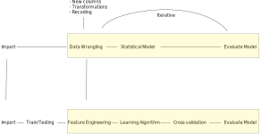
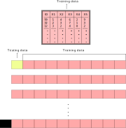
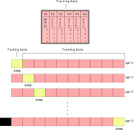
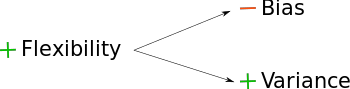
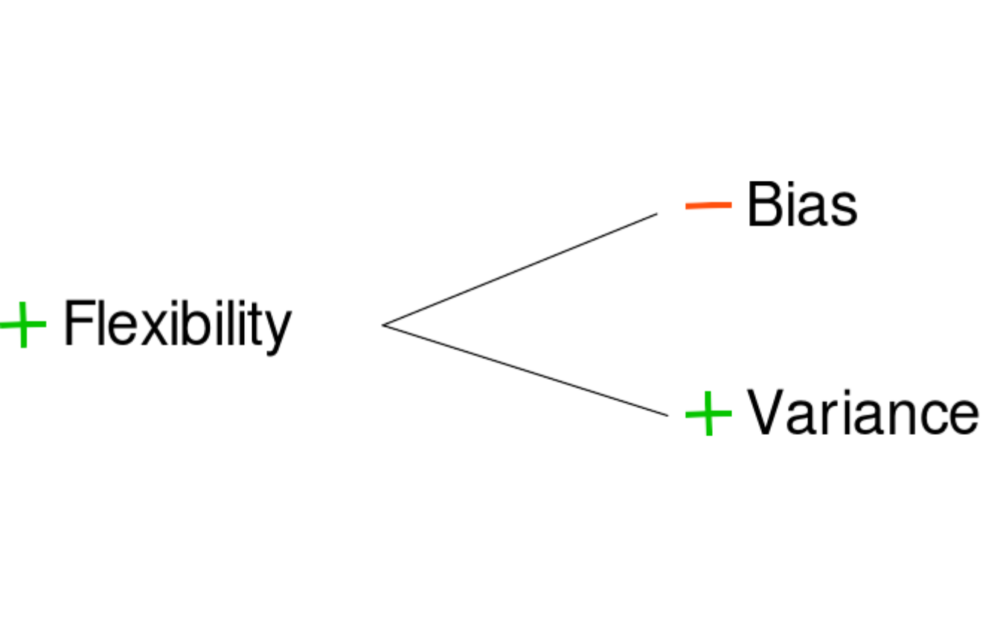
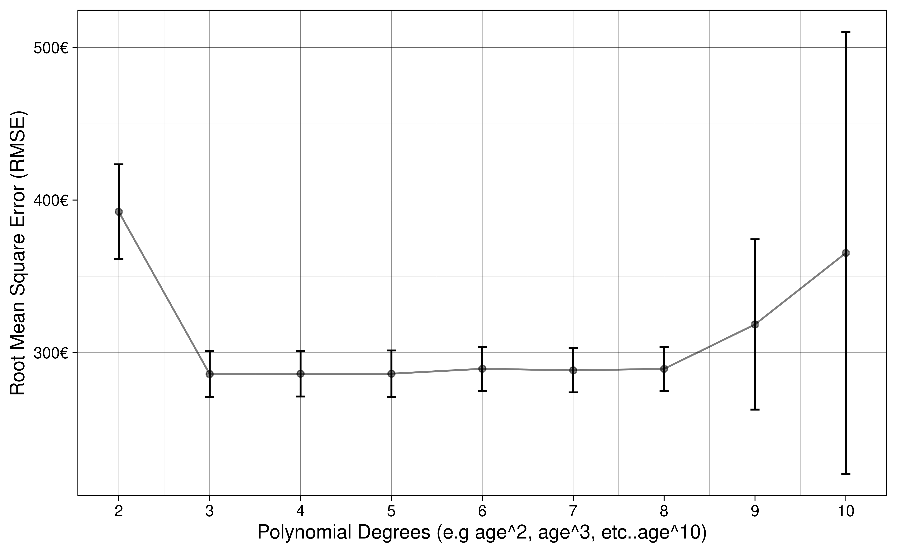

# Machine Learning for Social Scientists


Machine Learning practitioners and Social Scientists share many things in common. These shared traits are mostly related to the transformation, analysis and evaluation of statistical models. In fact, when many of my fellow social scientists take any introductory course on machine learning, I often hear that many of the things they get taught are very common in traditional statistics classes, if not the same. This is good news! This means that you already have a foot inside the field without even knowing it. Machine Learning practitioners use many of the same statistical model we use and also many of transformation techniques that we use. However, there are important differences on how we analyze data and how we answer our questions. In this chapter I will elaborate on how machine learning practitioners have developed strategies different from social scientists for analyzing their data, how their analysis workflow compares to ours and finally, a tour around their way of thinking, which has evolved to be very different from ours.

I hope that by understanding the strategies and techniques that machine learning practitioners use, social scientists would expand their analysis toolbox, allowing us to complement their way of thinking with our strong research design skills and modelling techniques.

## A different way of thinking

The first question we want to ask ourselves is, what is machine learning? Machine Learning bears indeed a fancy name which brings to mind thoughts related to artificial intelligence and robots. However, as you'll see throughout the course, most terms and models used in machine learning are actually what we know as **statistical models**. The overaching difference in the definition of machine learning and social statistics is not the models or new strategies for analyzing data. It is the main objective of the analysis. What is Machine Learning after all?

> Using statistical methods to learn the data enough to be able to predict it accurately on new data

That sounds somewhat familiar to us social scientists. Perhaps our goal is not to predict our data but it is certainly to **learn it** and **understand it**. In particular, social scientists are interested in figuring out if our theoretical description of the problem fits the data we have collected it. We do that by  carefully build a model that explains the problem, we try to learn it really well and finally understand it enough such that if we collected the exact same data again, our explanation would replicate. How does this differ from the way of thinking of machine learning practitioners? The main objective in a machine learning problem is accurate predictions; that is, regardless of how well we understand a problem, we want learn the data well enough to predict it well. Prediction problems are usually concerned with **building and tweaking** a model that predicts a dependent variable accurately on your data, such that when **new data** arrives, the model can predict it just as accurately.

The difference between the two cultures (breiman) is the problem of inference versus prediction. That is the fundamental difference between the approach used by social scientists and practitioners of machine learning. However, for having such drastic differences in our objective, we share a lot of common strategies. For example, here's the typical workflow of a social scientist:


This is our safe zone: we understand these steps and we've exercised them many times. We begin by importing our data and inmediately start to clean it. This involves, for example, collapsing fine grained groups into bigger categories, transforming variables using logarithms and creating new variables which reflect important concepts from our theoretical model. Once we're confident with our set of variables, we begin the iterative process of visualizing our data, fitting statistical models and evaluating the fit of the model. This is an iterative process because the results of our model might give us ideas on new variables or how to recode an existing variable. This prompts us to repeat the same process again with the aim of carefully building a model that fits the data well. Well,  let me break it to you but this same process is very familiar to the machine learning process:



They import their data, they wrangle their data, they fit statistical models and they evaluate the fit of their models. They might have different names for the same things but in essence, they are more or less the same. For example, here are some common terms in the machine learning literature which have exact equivalents in social statistics:

 * Features --> Variables
 * Feature Engineering --> Creating Variables
 * Learning Algorithms --> Statistical Models
 * Supervised Learning --> Models that have a dependent variable
 * Unsupervised Learning --> Models that don't have a dependent variable, such as clustering
 * Classifiers --> Models for predicting categorical variables, such as logistic regression
 
 and you'll find more around. These are the common steps which you'll find between both fields. However, machine Learning practioners have developed extra steps:
 


* Training/Testing data --> Unknown to us
* Cross-validation --> Unknown to us
* Loss functions --> Model fit --> Known to us but are not predominant ($RMSE$, $R^2$, etc...)

These are very useful concepts and we'll focus on those in this introduction. In this introduction I won't delve into the statistical models (learning algorithms) used in machine learning these will be discussed in later chapters but I wanted to highlight that although they share similarities with the models used in social statistics, there are many models used in the meachine learning literature which are unknown to us.

## Split your data into training/testing

Since the main objective in machine learning is to predict data accurately, all of their strategies are geared toward avoiding overfitting/underfitting. In other words, they want to capture all the signal and ignore the noise:


```r
library(ggplot2)
library(patchwork)
library(scales)

set.seed(2313)
n <- 500
x <- rnorm(n)
y <- x^3 + rnorm(n, sd = 3)
age <- rescale(x, to = c(0, 100))
income <- rescale(y, to = c(0, 5000))

age_inc <- data.frame(age = age, income = income)

y_axis <- scale_y_continuous(labels = dollar_format(suffix = "€", prefix = ""),
                             limits = c(0, 5000),
                             name = "Income")

x_axis <- scale_x_continuous(name = "Age")

bad_fit <-
  ggplot(age_inc, aes(age, income)) +
  geom_point() +
  geom_smooth(method = "lm") +
  y_axis +
  x_axis +  
  ggtitle("Underfit") +
  theme_linedraw()

overfit <-
  ggplot(age_inc, aes(age, income)) +
  geom_point() +
  geom_smooth(method = "loess", span = 0.015) +
  y_axis +
  x_axis +  
  ggtitle("Overfit") +
  theme_linedraw()

goodfit <-
  ggplot(age_inc, aes(age, income)) +
  geom_point() +
  geom_smooth(method = "loess", span = 0.9) +
  y_axis +
  x_axis +  
  ggtitle("Ideal fit") +
  theme_linedraw()

bad_fit + overfit + goodfit
```

<div class="figure" style="text-align: center">

<p class="caption">(\#fig:overfitplots)Different ways of fitting your data</p>
</div>

The first plot shows a model which is not flexible, as it fits a straight line without capturing the subtle non-linearities of the data. The second plot is **too** flexible as it captures much of the random noise of the non-linear relationship. Finally, the third plot shows the ideal fit, where the fitted line is flexible enough to capture the non-linear relationship in the data yet it it is mainly unaffected by the random noise in the data. How would social scientists fit a model? They would take the entire data


and fit the model on it. How do you know you're overfitting? Is there a metric? Is there a method? Well, one very easy and naive approach is to randomly divide your data into two chunks called training and testing:


The training data usually consists of a random sample of around ~70% of the initial data and the testing data a random sample of ~30% of the initial data. If a particular row is in the training data, it **must not** be on the testing data. If a particular row is in the testing data, it shouldn't be in the training data either. Let me clarify this: being in one chunk should mean that that specific row should **not** be in the other chunk. These two chunks should be completely independent of each other.  Why should splitting the data help us fix the problem of overfitting? Because you can elaborate your model in the training set as much as you want, and when you're confident enough, the testing set can serve as an **unseen, pristine source of data** on which you can evaluate your model. 

In the training chunk


fit your model and tweak it enough such that you can evaluate whether it's making accurate predictions. You can think of this chunk as the complete data to perform your analysis. It is the equivalent of the initial data where social scientists fit their data (that is, without partitiong).  Once you're very comfortable with your model, the best recipe for checking whether your model was overfit is to use this fitted model to predict on **the other chunk of data** (the testing data):


If you tweaked your model in such a way that it learned the noise of your training data, it will perform poorly on the testing data, since you the model didn't capture the overall trend in the data but rather the noise. 

For the sake of an example, let's suppose that you fit your model several times on the <span style='color: red;'>training</span> data, tweaking it to improve performance. When you think you're ready, you use this model to predict on the <span style='color: #D4FF2A;'>testing</span> data and find out that the model was indeed overfitting the data. You go back to the <span style='color: red;'>training</span> data, tweak some more, run some models again and when you think you're model is ready again, you predict on your <span style='color: #D4FF2A;'>testing</span> data again and find that it improved. Then you repeate the process again, $3$, $4$, $5$, etc... times. If you do that, you will, in very subtle ways, start to **overfit** your model on the <span style='color: #D4FF2A;'>testing</span> data! Think about it: you're fitting a model N times on your <span style='color: red;'>training</span> data, evaluating its fit on the <span style='color: #D4FF2A;'>testing</span> data and then **tweaking** again to improve the prediction on the <span style='color: #D4FF2A;'>testing</span> data. The <span style='color: #D4FF2A;'>testing</span> data should serve as the final dataset to compare your model: you should not tweak the model again after seeing how your model fits the **unseen** <span style='color: #D4FF2A;'>testing</span> data. 

How can we evaluate whether we're overfitting with the <span style='color: red;'>training</span> data alone, then? **Enter cross-validation**

## Cross-validation

The idea behind cross-validation is to allow the analyst check whether they're overfitting the data without predicting on the <span style='color: #D4FF2A;'>testing</span> data. How does it work? First, we **only** select our <span style='color: red;'>training</span> data


and replicate the <span style='color: red;'>training</span> data 10 times


The 10 rectangular red rows below the <span style='color: red;'>training</span> data, contain an exact replica of the initial <span style='color: red;'>training</span> data. That is, if the initial <span style='color: red;'>training</span> data has 500 rows and 10 columns, then each of these red rectangled rows also have 500 rows and 10 columns. The idea behind this approach is that for each rectangled row, you can use 70% of the data to fit your model and then predict on the remaining 30%. For example, for the first rectangled row, you would fit your initial model model with some tweak (let's say, adding a squared term to the age variable to check if that improves fit) on the <span style='color: red;'>training</span> data and then predict on the <span style='color: #D4FF2A;'>testing</span> data to evaluate the fit:



For the second rectangled row, fit the exact same model (that is, including the age squared term) on 70% of the <span style='color: red;'>training</span> data and predict on the <span style='color: #D4FF2A;'>testing</span> data. And then repeat the same iteration until the end of rectangled rows:



In each iteration, measure the $RMSE$ (you could record other metrics of fit, such as the $R^2$, $AIC$, $BIC$, etc...) of the predictions on the <span style='color: #D4FF2A;'>testing</span> data such that after you've fitted the model and evaluated the model 10 times, you have 10 values of the $RMSE$. With these 10 values you can calculate the average $RMSE$ and standard errors of your model performance.

Note that with this approach, the <span style='color: #D4FF2A;'>testing</span> data changes in each rectangled row, making sure that each ~30% chunk of the data passes through the <span style='color: #D4FF2A;'>testing</span> dataset at some point during the predictions. This is done to ensure the predictions are as balanced as possible.

This approach offers a way to iterate as many times as you want on tweaking your model and predicting on the cross-validated <span style='color: #D4FF2A;'>testing</span> data without actually predicting on the initial <span style='color: #D4FF2A;'>testing</span> dataset. This is the least bad approach that is **currently** accepted in the literature. 

Why is it the least bad approach? Because if we tweak the model on these 10 replicas one time, then a second time, then a third time, etc..., we'll also start overfitting on each of these 10 slots. The superiority of this approach over tweaking on the <span style='color: red;'>training</span> data is that since we have 10 replicas, we can take the average of model fit metrics and also obtain standard errors. This allows to have a somewhat balanced account of how our model fit is doing and the uncertainty around it.

That said, since we will always overfit in someway using a cross-validation approach, the final error of your model fit on the <span style='color: red;'>training</span> data will always be over optimistic (lower error than what you will actually have, if you predicted on the **pristine** <span style='color: #D4FF2A;'>testing</span> data.

## Bias-Variance Tradeoff

Before we elaborate a complete coded example, it's important to talk about the famous bias-variance tradeoff, used in machine learning problems. As was shown in figure \@ref(fig:overfitplots), we want the ideal fit without overfitting or underfitting the data. In some instances, fitting the data that well is very difficult because we don't have variables that reflect the data generating process or because the relationship is too complex. In that case, for machine learning problems, you might want to either underfit or overfit slightly, depending on your problem. 

Overfitting your data has some value, which is that we learn the data very well. This is often called a model with a lot of flexibility. A model that can learn all the small intricacies of the data is often called a **flexible** model.  There is **very** little bias in a model like this one, since we learn the data very very well. However, at the expense of bias, overfitting has **a lot** of variance. If we predict on a new dataset using the overfitted model, we'll find a completely different result from the initial model. If we repeat the same on another dataset, we'll find another different result. That is why models which can be very flexible are considered to have very little bias and a lot of variance:



The model above fits the criteria:


On the other hand, models which are **not** flexible, have more bias and less variance. One familiar example of this is the linear model. By fitting a straight line through the data, the variance is very small: if we run the same exact model on a new data, the fitted line is robust to slight changes in the data. However, the fitted line doesn't really capture the subtle trends in the data (assuming the relationship is non-linear, which is the case in most cases). That is why non-flexible models are often called to have high bias and low variance:


or in other words:


In reality, what we usually want is something located in the middle of these two extremes: we want a model that is neither too flexible that overfits the data nor too unflexible that misses the signal. There is really no magical recipe to achieving the perfect model and our best approach is to understand our model's performance using techniques such as cross-validation to assess how much our model is overfitting/underfitting the data.

## An example

Let's combine all the new steps into a complete pipeline of machine learning. Let's say we have the age of a person and their income and we want to predict their income based on their age. The rectangular data looks like this:

<!--html_preserve--><div id="htmlwidget-4c09a4ce4c01f2b64aad" style="width:100%;height:auto;" class="datatables html-widget"></div>
<script type="application/json" data-for="htmlwidget-4c09a4ce4c01f2b64aad">{"x":{"filter":"none","data":[["1","2","3","4","5","6"],[44,29,66,66,57,39],[2203,2162,2441,2938,2574,2091]],"container":"<table class=\"display\">\n  <thead>\n    <tr>\n      <th> <\/th>\n      <th>age<\/th>\n      <th>income<\/th>\n    <\/tr>\n  <\/thead>\n<\/table>","options":{"columnDefs":[{"className":"dt-right","targets":[1,2]},{"orderable":false,"targets":0}],"order":[],"autoWidth":false,"orderClasses":false}},"evals":[],"jsHooks":[]}</script><!--/html_preserve-->

The relationship between these two variables is non-linear, showing the common mintzer equation where income increases with age up to a certain age:


```r
library(tidyverse)
library(tidymodels)
library(scales)

set.seed(2313)
n <- 500
x <- rnorm(n)
y <- x^3 + rnorm(n, sd = 3)
age <- rescale(x, to = c(0, 100))
income <- rescale(y, to = c(0, 5000))

age_inc <- data.frame(age = age, income = income)

age_inc %>%
  ggplot(aes(age, income)) +
  geom_point() +
  theme_linedraw()
```



To analyze the data, we must first partition it into <span style='color: red;'>training</span> an <span style='color: #D4FF2A;'>testing</span>. We can do that with `initial_split`:


```r
set.seed(213151)
split_age_inc <- initial_split(age_inc)
train_df <- training(split_age_inc)
test_df <- testing(split_age_inc)
```

The <span style='color: red;'>training</span> and <span style='color: #D4FF2A;'>testing</span>  data should be, on average, the same, given that the rows were picked randomly. However, the rows present in the <span style='color: red;'>training</span> set must **not** be in the <span style='color: #D4FF2A;'>testing</span> set.


```r
head(train_df)
```

```
##        age   income
## 1 44.25888 2203.475
## 3 65.80879 2440.691
## 5 56.85766 2574.268
## 7 62.84881 2327.790
## 8 74.35803 2583.404
## 9 84.94890 3548.240
```


```r
head(test_df)
```

```
##         age   income
## 2  29.49615 2162.250
## 4  66.28708 2938.295
## 6  38.90431 2090.921
## 14 93.83987 3866.429
## 22 44.31070 2635.062
## 25 71.72728 2424.363
```

Now, let's begin running some models. The first model we'd like run is a simple regression `income ~ age` on the **<span style='color: red;'>training</span>** data and plot the fitted values:


```r
mod1 <- lm(income ~ age, data = train_df)

pred_vals <- function(mod, trn_df) {
  pred_df <-
    bind_cols(
      trn_df,
      pred_income = predict(mod, newdata = trn_df)
    )
  
  pred_df
}

pred_df <- pred_vals(mod1, train_df)
rmse_pred <- rmse_vec(pred_df$income, pred_df$pred_income)

pred_income <- function(mod, trn_df) {

  pred_df <- pred_vals(mod, trn_df)
  
  train_df %>%
    ggplot(aes(age, income)) +
    geom_point() +
    geom_line(data = pred_df, aes(y = pred_income), color = "red") +
    scale_x_continuous(name = "Age") +
    scale_y_continuous(name = "Income",
                       label = dollar_format(suffix = "€", prefix = "")) +
    theme_linedraw()
}

pred_income(mod1, train_df)
```


It seems we're underfitting the relationship. To measure the **fit** of the model, we'll use the Root Mean Square Error (RMSE). Remember it?

$$ RMSE = \sqrt{\sum_{i = 1}^n{\frac{(\hat{y} - y)^2}{N}}} $$

The current $RMSE$ of our model is 387.48. This means that on average our predictions are off by around 387.48 euros. The fitted line is underfitting the relationship because it cannot capture the non-linear trend in the data. How do we increase the fit? We could add non-linear terms to the model, for example $age^2$, $age^3$, ..., $age^{10}$. 

However, remember, by fitting very high non-linear terms to the data, we might get lower error from the model but that's because the model is **learning** the data so much that it starts to capture noise rather than the signal. This means that when we predict on the **unseen** <span style='color: #D4FF2A;'>testing</span> data, our model would not know how to identify the signal in the data. How can we be sure we're picking the best model specification?

**This is where cross-validation comes in!**

We can use the function `vfold_cv` to separate the <span style='color: red;'>training</span> data into 10 cross-validation sets, which each one has a <span style='color: red;'>training</span> and <span style='color: #D4FF2A;'>testing</span> data.


```
## #  10-fold cross-validation 
## # A tibble: 10 x 2
##    splits           id    
##    <named list>     <chr> 
##  1 <split [337/38]> Fold01
##  2 <split [337/38]> Fold02
##  3 <split [337/38]> Fold03
##  4 <split [337/38]> Fold04
##  5 <split [337/38]> Fold05
##  6 <split [338/37]> Fold06
##  7 <split [338/37]> Fold07
##  8 <split [338/37]> Fold08
##  9 <split [338/37]> Fold09
## 10 <split [338/37]> Fold10
```

Each of those `split` objects (there are 10) contains a <span style='color: red;'>training</span> and <span style='color: #D4FF2A;'>testing</span> set. This is the equivalent of the image we saw before:


<br>

The next thing we have to do is train the same model on the <span style='color: red;'>training</span> data of each of these cross-validated sets, use these trained models to predict on the 10 <span style='color: #D4FF2A;'>testing</span> sets and record the error rate using our $RMSE$ metric. But don't worry, you don't have to do that all that model fitting manually. There are already several packages that do this automatically:


```r
# Define the formula of your model and specify that the polynomial
# value will be 'tuned'. That is, we will try several values
# instead of only one.
rcp_train <-
  recipe(income ~ age, data = train_df) %>%
  step_poly(age, degree = tune())

# Define the linear model
mod <- set_engine(linear_reg(), "lm")

# Join everything into a complete pipeline
wflow <-
  workflow() %>%
  add_recipe(rcp_train) %>%
  add_model(mod)

# Specify the number of polynoymials we want to try:
# age^2, age^3, ..., age^10
grid_vals <- data.frame(degree = 2:10)
res_tuning <- tune_grid(wflow,
                        vfold_train,
                        grid = grid_vals)

# Visualize the result
res_tuning %>%
  collect_metrics() %>%
  filter(.metric == "rmse") %>% 
  mutate(uc_low = mean - 1.96 * std_err,
         uc_high = mean + 1.96 * std_err) %>%
  ggplot(aes(degree, mean)) +
  geom_point(alpha = 1 / 2) +
  geom_line(alpha = 1 / 2) +
  geom_errorbar(aes(ymin = uc_low, ymax = uc_high), width = 0.1) +
  scale_x_continuous(name = "Polynomial Degrees (e.g age^2, age^3, etc..age^10)",
                     breaks = 1:10,
                     labels = as.integer) +
  scale_y_continuous(name = "Root Mean Square Error (RMSE)",
                     label = dollar_format(suffix = "€", prefix = "")) +
  theme_linedraw()
```



The resulting error terms show that any polynomial above 2 has very similar error rates. However, there is a point in which adding $age^8$, $age^9$ and $age^10$, increases the error rate. This is a good example where a lot of flexibility (fitting the non-linear trend **very** well), increases accuracy on the <span style='color: red;'>training</span> set but show a lot variability on the <span style='color: #D4FF2A;'>testing</span> set. The $RMSE$ that we saw in the figure is the recorded $RMESE$ from the <span style='color: #D4FF2A;'>testing</span> set.

Given that most of the polynomial terms have similar error terms, we usually would go for the most simple model, that is, the model with $age^3$. We can run the model on the entire **<span style='color: red;'>training</span>** data with 3 non-linear terms and check the fit:


```r
mod1 <- lm(income ~ poly(age, 3), data = train_df)

pred_df <- pred_vals(mod1, train_df)
rmse_pred <- round(rmse_vec(pred_df$income, pred_df$pred_income), 2)

pred_income(mod1, train_df)
```


The $RMSE$ on the **<span style='color: red;'>training</span>** data for the three polynomial model is 282.81. We need to compare that to our **<span style='color: #D4FF2A;'>testing</span>** $RMSE$. 


```r
rmse_pred2 <- round(rmse_vec(test_df$income, predict(mod1, newdata = test_df)), 2)

pred_income(mod1, test_df)
```


* <span style='color: red;'>training</span> $RMSE$ is 282.81
* <span style='color: #D4FF2A;'>testing</span> $RMSE$ is 303.08

<span style='color: #D4FF2A;'>testing</span> $RMSE$ will almost always be higher, since we always overfit the data in some way through cross-validation.
