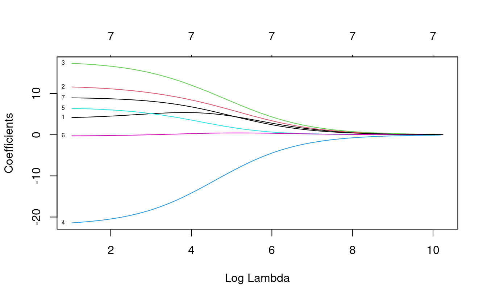
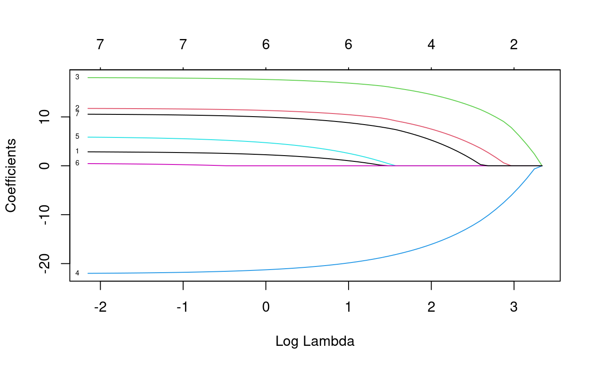
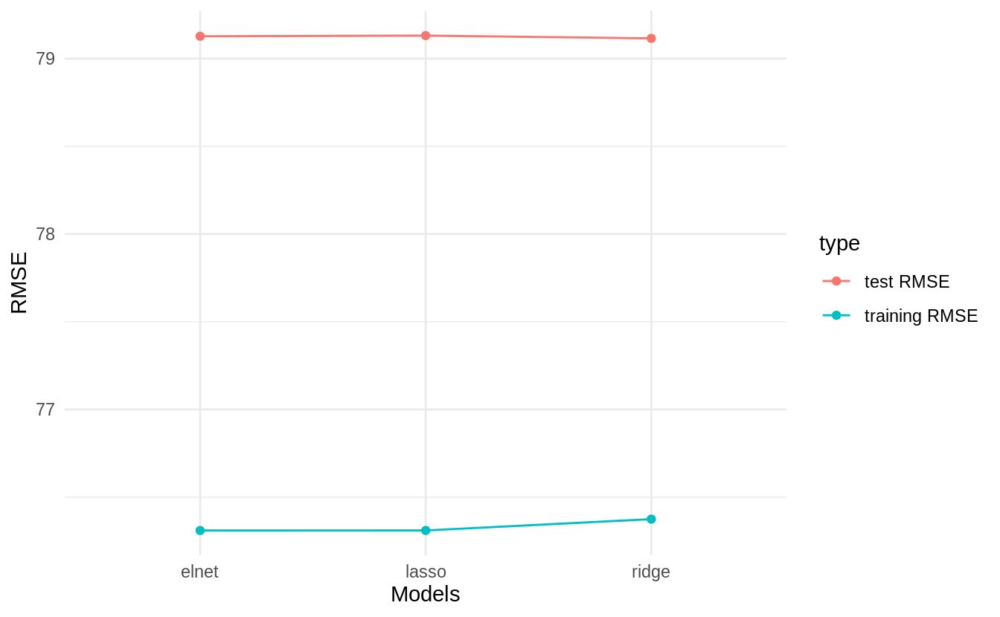

# Regularization


Regularization is a common topic in machine learning and bayesian statistics. In this document, we will describe the three most common regularized linear models in the machine learning literature and introduce them in the context of the PISA data set. At the end of the document you'll find exercises that will put your knowledge to the test. Most of this material is built upon Boehmke & Greenwell (2019) and Friedman et al. (2001).

## Ridge regularization

Do no let others fool you into thinking that ridge regression is a fancy artificial intelligence algorithm. Are you familiar with linear regression? If you are, then ridge regression is just a very **simple** adaptation of linear regression. 

The whole aim of linear regression, or Ordinary Least Squares (OLS), is to minimize the sum of the squared residuals. In other words, fit `N` number of regression lines to the data and keep only the one that has the lowest sum of squared residuals. In simple formula jargon, OLS tries to **minimize** this:

\begin{equation}
RSS = \sum_{k = 1}^n(actual_i - predicted_i)^2
\end{equation}

For each fitted regression line, you compare the predicted value ($predicted_i$) versus the actual value ($actual_i$), square it, and add it all up. Each fitted regression line then has an associated Residual Sum of Squares (RSS) and the linear model chooses the line with the lowest RSS.

> Note: Social scientists are familiar with the RSS and call it just by it's name. However, be aware that in machine learning jargon, the RSS belongs to a general family called  **loss functions**. Loss functions are metrics that evaluate the **fit** of your model and there are many around (such as AIC, BIC or R2).

Ridge regression takes the previous RSS loss function and adds one term:

\begin{equation}
RSS + \lambda \sum_{k = 1}^n \beta^2_j
\end{equation}

The new term is called a *shrinkage penalty* because it forces each coefficient $\beta_j$ closer to zero by squaring it. The shrinkage part is clearer once you think of this term as forcing each coefficient to be as small as possible but also considering having the smallest Residual Sum of Squares (RSS). In other words, we want the smallest coefficients that don't affect the fit of the line (RSS).

An intuitive example is to think of RSS and $\sum_{k = 1}^n \beta^2_j$ as two separate things. RSS estimates how the model fits the data and $\sum_{k = 1}^n \beta^2_j$ limits how much you overfit the data. Finally, the little $\lambda$ between these two terms can be interpreted as a "weight". The higher the lambda, the higher the weight that will be given to the shrinkage term of the equation. If $\lambda$ is 0, then multiplying 0 by $\sum_{k = 1}^n \beta^2_j$ will always return zero, forcing our previous equation to simply be reduced to the single term $RSS$.

Why is there a need to "limit" how well the model fits the data? Because we, social scientists and data scientists, very commonly **overfit** the data. The plot below shows a simulation from [Simon Jackson](https://drsimonj.svbtle.com/ridge-regression-with-glmnet) where we can see that when tested on a training set, OLS and Ridge tend to overfit the data. However, when tested on the test data, Ridge regression has lower out of sample error as the $R2$ is higher for models with different observations.


The strength of the ridge regression comes from the fact that it compromises fitting the training data really well for improved generalization. In other words, we increase **bias** (because we force the coefficients to be smaller) for lower **variance** (but we make it more general). In other words, the whole gist behind ridge regression is penalizing very large coefficients for better generalization. 

Having that intuition in mind, the predictors of the ridge regression need to be standardized. Why is this the case? Because due to the scale of a predictor, its coefficient can be more penalized than other predictors. Suppose that you have the income of a particular person (measured in thousands per months) and time spent with their families (measured in seconds) and you're trying to predict happiness. A one unit increase in salary could be penalized much more than a one unit increase in time spent with their families **just** because a one unit increase in salary can be much bigger due to it's metric.

In R, you can fit a ridge regression (and nearly all other machine learning models) through the `caret` package. Let's load the packages that we will work with and read the data:


```r
library(caret) # Fitting machine learning models
library(rsample) # Create data partitions
library(vip) # For figuring out important variables for prediction

data_link <- "https://raw.githubusercontent.com/cimentadaj/ml_socsci/master/data/pisa_us_2018.csv"
pisa <- read.csv(data_link)
```

First thing we do is separate the training and test data. All of our modelling will be performed on the training data and the test data is saved for later (the test data must be completely ignored until you have your final tuned model).


```r
# Separate training/testing split

# Place a seed for reproducing the results
set.seed(23141)
split_pisa <- initial_split(data = pisa, prop = .7)
pisa_test <- testing(split_pisa)
pisa_train <- training(split_pisa)
```

The ridge regression has a parameter called `lambda` which needs to be set by us. `lambda` is the "weight" term in the ridge equation, which controls how much weight do we want to give to the "shrinkage penalty". If this lambda is 0, it means we attach **no** weight to the penalty term and we will get the same result over OLS. Let's try that:


```r
############################# Ridge regression ################################
###############################################################################

ridge_grid <- data.frame(
  # Here we specify the lambda to be zero
  lambda = 0,
  # Here we specify the type of penalized regression: 0 is ridge regression
  alpha = 0
)

# The train function accepts several arguments
ridge_mod <- train(
  # math_score is the dependent variable and all other are independent variables
  math_score ~ MISCED + FISCED + HISEI + REPEAT + IMMIG + DURECEC + BSMJ,
  # The training data
  data = pisa_train,
  # The R package that runs the ridge regression
  method = "glmnet",
  # Here is where we pass the lambda argument
  tuneGrid = ridge_grid,
  lambda = 0,
  # Here is where the function standardizes the predictors before
  # fitting the models
  preProc = c("center", "scale"),
  trControl = trainControl(method = "none")
)

# Get ridge coefficients
res <- ridge_mod$finalModel
ridge_coef <- predict(res, s = 0, type = "coefficients")

############################# Linear model ####################################
###############################################################################

iv_vars <- c("MISCED", "FISCED", "HISEI", "REPEAT", "IMMIG", "DURECEC", "BSMJ")
pisa_tst <- pisa_train
pisa_tst[iv_vars] <- scale(pisa_tst[iv_vars])

lm_coef <- coef(
  lm(math_score ~ MISCED + FISCED + HISEI + REPEAT + IMMIG + DURECEC + BSMJ,
     data = pisa_tst)
)

############################# Comparing model #################################
###############################################################################

comparison <-
  data.frame(coefs = names(lm_coef),
             `Linear coefficients` = unname(round(lm_coef, 2)),
             `Ridge coefficients` = round(as.vector(ridge_coef), 2))

knitr::kable(comparison)
```


coefs          Linear.coefficients   Ridge.coefficients
------------  --------------------  -------------------
(Intercept)                 473.05               473.05
MISCED                        2.94                 2.94
FISCED                       11.78                11.78
HISEI                        18.07                18.07
REPEAT                      -22.09               -22.09
IMMIG                         6.01                 6.01
DURECEC                       0.55                 0.55
BSMJ                         10.62                10.62

Coming from a social science background, it might seem counterintuitive that the researcher has to specify tuning parameters for the model. In traditional social science statistics, models usually estimate similar values internally and the user doesn't have to think about them. However, there are strategies already implemented to explore the combination of many possible values. With our previous example, we just have to add a number of lambda values and `train` will find the best one:


```r
set.seed(663421)

ridge_grid <- data.frame(
  # Here we specify the lambda to several possible values
  lambda = seq(0, 3, length.out = 300),
  # Here we specify the type of penalized regression: 0 is ridge regression
  alpha = 0
)

ridge_mod <- train(
  math_score ~ MISCED + FISCED + HISEI + REPEAT + IMMIG + DURECEC + BSMJ,
  data = pisa_train,
  method = "glmnet",
  tuneGrid = ridge_grid,
  preProc = c("center", "scale"),
  # Performs cross validation through all grid parameters
  trControl = trainControl(method = "cv", number = 5)
)

plot(ridge_mod$finalModel, xvar = "lambda", label = TRUE)
```



Here we can see how our coefficients are affected by increasing weight of the `lambda` parameter. And we can figure out the best lambda inspecting `bestTune` inside `ridge_mod`:


```r
best_lambda_ridge <- ridge_mod$bestTune$lambda
best_lambda_ridge
```

```
## [1] 2.67893
```

However, there's no need to rerun the model with this optimal value; since `train` **had** to run that model, it saves it as the most optimal:


```r
holdout_ridge <-
  RMSE(
    predict(ridge_mod, pisa_test, s = best_lambda_ridge),
    pisa_test$math_score
  )

train_rmse_ridge <-
  ridge_mod$results %>%
  filter(lambda == best_lambda_ridge) %>%
  pull(RMSE)

c(holdout_rmse = holdout_ridge, train_rmse = train_rmse_ridge)
```

```
## holdout_rmse   train_rmse 
##     79.11585     76.37490
```

The holdout RMSE will always be higher than the training RMSE as the training set nearly always **memorizes** the data better for the training.

## Lasso regularization

The Lasso regularization is very similar to the ridge regularization where only one thing changes: the penalty term. Instead of squaring the coefficients in the penalty term, the lasso regularization takes the absolute value of the coefficient.

\begin{equation}
RSS + \lambda \sum_{k = 1}^n |\beta_j|
\end{equation}

Althought it might not be self-evident from this, the lasso reguralization has an important distinction: it can force a coefficient to be zero. This means that lasso does a selection of variables which have big coefficients while not compromising the RSS of the model. The problem with ridge regression is that as the number of variables increases, the training error will almost always decrease but the test error will not.

For example, if we define the same model from above using a lasso, you'll see that it forces coefficients to be **exactly zero** if they don't add anything relative to the RSS of the model. This means that variables which do not add anything to the model will be excluded unless they add explanatory power that compensates the size of their coefficient. Here's the same lasso example:


```r
set.seed(663421)

lasso_grid <- data.frame(
  # Here we specify the lambda to several possible values
  lambda = seq(0, 3, length.out = 300),
  # Here we specify the type of penalized regression: 1 is lasso regression
  alpha = 1
)

lasso_mod <- train(
  math_score ~ MISCED + FISCED + HISEI + REPEAT + IMMIG + DURECEC + BSMJ,
  data = pisa_train,
  method = "glmnet",
  tuneGrid = lasso_grid,
  preProc = c("center", "scale"),
  trControl = trainControl(method = "cv")
)

plot(lasso_mod$finalModel, xvar = "lambda", label = TRUE)
```



In contrast to the ridge regression, where coefficients are forced to be close to zero, the lasso penalty actually forces some coefficients **to be zero**. This property means that the lasso makes a **selection of the variables with the higher coefficients** and eliminates those which do not have a strong relationship. Lasso is usually better at model interpretation because it removes redundant variables while ridge can be useful if you want to keep a number of variables in the model, despite them being weak predictors (as controls, for example).

The lasso actually works exactly as the ridge in the `caret` package, meaning that it automatically checks the most optimal value for lambda:


```r
best_lambda_lasso <- lasso_mod$bestTune$lambda
best_lambda_lasso
```

```
## [1] 0.1906355
```

To actually check the final model and which variables are kept, we can access it:


```r
holdout_lasso <-
  RMSE(
    predict(lasso_mod, pisa_test, s = best_lambda_lasso),
    pisa_test$math_score
  )

train_rmse_lasso <-
  lasso_mod$results %>%
  filter(lambda == best_lambda_lasso) %>%
  pull(RMSE)

c(holdout_rmse = holdout_lasso, train_rmse = train_rmse_lasso)
```

```
## holdout_rmse   train_rmse 
##     79.13141     76.31036
```

So far, we can check which model is performing better:


```r
model_comparison <-
  data.frame(
    type = c("test RMSE", "training RMSE"),
    ridge = c(holdout_ridge, train_rmse_ridge),
    lasso = c(holdout_lasso, train_rmse_lasso)
  )

model_comparison
```

```
##            type    ridge    lasso
## 1     test RMSE 79.11585 79.13141
## 2 training RMSE 76.37490 76.31036
```

Currently the ridge regression has a very minor advantaged over the lasso yet the difference is probably within the margin of error. Depending on your aim, you might want to choose either of the models. For example, if our models contained a lot of variables, lasso might be more interpretable as it reduces the number of variables. However, if you have reasons to believe that keeping all variables in the model is important, then ridge provides an advantage.

## Elastic Net regularization

If you're aware of ridge and lasso, then elastic net regularization is a logical step. Elastic Net (the name sounds fancy, but it is also an adaptation of OLS) combines both penalties to form one single equation.

Here we define our ridge penalty:

$$ridge = \lambda \sum_{k = 1}^n |\beta_j|$$

And here we define our lasso penalty:

$$lasso = \lambda \sum_{k = 1}^n \beta_j^2$$

Elastic net regularization is the addition of these two penalties in comparison to the RSS:

$$RSS + lasso + ridge$$

I think the best explanation for elastic net reguarlization comes from Boehmke & Greenwell (2019):

> Although lasso models perform feature selection, when two strongly correlated features are pushed towards zero, one may be pushed fully to zero while the other remains in the model. Furthermore, the process of one being in and one being out is not very systematic. In contrast, the ridge regression penalty is a little more effective in systematically handling correlated features together. Consequently, the advantage of the elastic net penalty is that it enables effective regularization via the ridge penalty with the feature selection characteristics of the lasso penalty.

Essentially, you now have two tuning parameters. In the grid of values, instead of specifying an alpha of `0` (ridge) or `1` (lasso), `caret` will slide through several values of `alpha` ranging from 0 to 1 and compare that to several values of `lambda`.

However, `train` can already take care of this and calculate the most optimal value automatically with specifying a grid of values:


```r
set.seed(663421)

elnet_mod <- train(
  math_score ~ MISCED + FISCED + HISEI + REPEAT + IMMIG + DURECEC + BSMJ,
  data = pisa_train,
  method = "glmnet",
  preProc = c("center", "scale"),
  trControl = trainControl(method = "cv"),
  # Here 25 means that it will try 25 values of
  # alpha and then N numbers of alpha
  tuneLength = 25
)

best_lambda_elnet <- elnet_mod$bestTune$lambda

holdout_elnet <-
  RMSE(
    predict(elnet_mod, pisa_test),
    pisa_test$math_score
  )

train_rmse_elnet <-
  elnet_mod$results %>%
  filter(alpha == elnet_mod$bestTune$alpha, lambda == best_lambda_elnet) %>%
  pull(RMSE)

c(holdout_rmse = holdout_elnet, train_rmse = train_rmse_elnet)
```

```
## holdout_rmse   train_rmse 
##     79.12763     76.31005
```

The RMSE of the elastic net is somewhat lower than then ridge and lasso but also probably within the margin of error. Let's compare it visually:


```r
model_comparison$elnet <- c(holdout_elnet, train_rmse_elnet)
model_comparison
```

```
##            type    ridge    lasso    elnet
## 1     test RMSE 79.11585 79.13141 79.12763
## 2 training RMSE 76.37490 76.31036 76.31005
```

```r
model_comparison %>%
  pivot_longer(-type) %>%
  ggplot(aes(name, value, color = type, group = type)) +
  geom_point(position = "dodge") +
  geom_line() +
  scale_y_continuous(name = "RMSE") +
  scale_x_discrete(name = "Models") +
  theme_minimal()
```



## Exercises

The [Fragile Families Challenge](https://www.fragilefamilieschallenge.org/) is a study that aimed to predict a series of indicators of children at age 15 only using data from ages 0 to 9. With this challenge, the principal investigators wanted to test whether skills such as cognitive and non-cognitive abilities were correctly predicted. With that idea in mind, they were interested in following up children that beat the 'predictions': those children that exceeded the model's prediction, for example given their initial conditions.

Using a similarly constructed non-cognitive proxy, I've created a non-cognitive index using the PISA 2018 for the United States which is the average of the questions:

- ST182Q03HA - I find satisfaction in working as hard as I can.
- ST182Q04HA - Once I start a task, I persist until it is finished.
- ST182Q05HA - Part of the enjoyment I get from doing things is when I improve on my past performance.
- ST182Q06HA - If I am not good at something, I would rather keep struggling to master it than move on to something I may [...]

The scale of the index goes from 1 to 4, where 4 the student strongly agrees and 1 is they completely disagree. In other words, this index shows that the higher the value, the higher the non cognitive skills. You can check out the complete PISA codebook [here](https://docs.google.com/spreadsheets/d/12--3vD737rcu6olviKutRLEiyKNZ2bynXcJ4CpwtNsQ/edit?usp=sharing).

In these series of exercises you will have to try different models that predict this index of non-cognitive skills, choose the best model and look at the most important variables.

First, read in the data with:


```r
data_link <- "https://raw.githubusercontent.com/cimentadaj/ml_socsci/master/data/pisa_us_2018.csv"
pisa <- read.csv(data_link)
```

### Split the data into test/training data

Remember to set the seed to `2341` so that everyone can compare their results.


### Run a ridge regression with non-cognitive as the dependent variable

Use as many variables as you want (you can reuse the previous variables from the examples or pick all of them). A formula of the like `noncogn ~ .` will regress `noncogn` on all variables.


```r
# 1) Define ridge grid of values for lambda
ridge_grid <- data.frame(
  lambda = 
  alpha = 0
)

# 2) Use the train function to train the model on the *training set*

# 3) Extract the best lambda and calculate the RMSE on the test set

# 4) Extract the RMSE of the training set

# 5) Compare both holdout and training RMSE
```


### Which are the most important variables?

Comment on their coefficients and whether they make sense to be included in the model.


### Run a lasso regression with the same specification as above


```r
# Define ridge grid of values for lambda
lasso_grid <- data.frame(
  lambda = 
  alpha = 1
)

# Reproduce previous steps
```


Which model is performing better? Ridge or Lasso? Are the same variables the strongest predictors across models? Which variables are the strongest predictors?

### Run an elastic net regression on non cognitive skills

Since `train` already takes care of trying all possible values, there's no need to pass a grid of lambda values. It is only needed to set the `tuneLength` to a number of alpha values.


### Compare the three models graphically

* Comment on which models is better in out-of-sample fit
* Is it better to keep the most accurate model or a model that includes relevant confounders (even if they're relationship is somewhat weak)?

You can find the answer to all problems [here](./answers/02_regularization.R)


## Bibliography

Boehmke, B., & Greenwell, B. M. (2019). Hands-On Machine Learning with R. CRC Press.

Friedman, J., Hastie, T., & Tibshirani, R. (2001). The elements of statistical learning (Vol. 1, No. 10). New York: Springer series in statistics.

