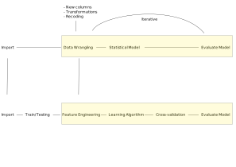
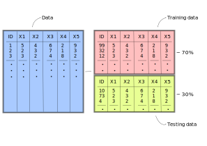
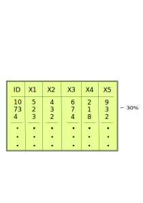
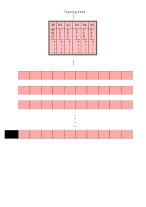

layout: true

<!-- background-image: url(./figs/upf.png) -->
background-position: 100% 0%, 100% 0%, 50% 100%
background-size: 10%, 10%, 10%

```{r, echo = FALSE}

knitr::opts_chunk$set(warning = FALSE,
                      message = FALSE, 
                      fig.width = 10.5,
                      fig.height = 4, 
                      comment = NA,
                      rows.print = 16)

```

---

# An introduction to the Machine Learning Framework


**What is Machine Learning after all?**

.left-colum[
.center[
> Using statistical methods to **learn** the data enough to be able to predict it accurately on new data
]
]

--

<br>
<br>

That sounds somewhat familiar to social scientists `r emo::ji("thinking")`

- Perhaps our goal is not to **predict** it but it is certainly to **learn** it and **understand** it

<br>
<br>

--

Here comes the catch: 
> ML doesn't want to **understand** the problem; it wants to learn it enough to **predict** it well.

---
class: center, middle

# How do social scientists work?

```{r, echo = FALSE, out.width = "90%"}
knitr::include_graphics("./img/socsci_wflow1.svg")
```


---
# Prediction vs Inference

- Social Scientists are concerned with making inferences about their data
> If a new data source comes along, their results should be able to replicate.

<br>

- Data Scientits are concerned with making predictions about their data
> If a new data source comes along, they want to be able to predict it accurately.

<br>
<br>

--

.center[
.large[
**What's the common framework?**
]
]

---
name: fat
class: inverse, top, center
background-image: url(img/bart_replicability.png)
background-size: cover

---

<br>
<br>
<br>

.center[
```{r, warnings = FALSE, echo = FALSE, out.height = "90%", dpi = 300}
library(ggplot2)
library(patchwork)
library(scales)

set.seed(2313)
n <- 500
x <- rnorm(n)
y <- x^3 + rnorm(n, sd = 3)
age <- rescale(x, to = c(0, 100))
income <- rescale(y, to = c(0, 5000))

age_inc <- data.frame(age = age, income = income)

y_axis <- scale_y_continuous(labels = dollar_format(suffix = "€", prefix = ""),
                             limits = c(0, 5000),
                             name = "Income")

x_axis <- scale_x_continuous(name = "Age")

underfit <-
  ggplot(age_inc, aes(age, income)) +
  geom_point() +
  geom_smooth(method = "lm") +
  y_axis +
  x_axis +  
  ggtitle("Underfit") +
  theme_linedraw()

overfit <-
  ggplot(age_inc, aes(age, income)) +
  geom_point() +
  geom_smooth(method = "loess", span = 0.015) +
  y_axis +
  x_axis +  
  ggtitle("Overfit") +
  theme_linedraw()


goodfit <-
  ggplot(age_inc, aes(age, income)) +
  geom_point() +
  geom_smooth(method = "loess", span = 0.9) +
  y_axis +
  x_axis +  
  ggtitle("Ideal fit") +
  theme_linedraw()


underfit + overfit + goodfit
```
]


.center[Very important to ML! (as it should be in Social Science)]

---
class: center, middle

# Where Social Scientists have gone wrong

Tell me a strategy that you were taught to make sure your results are replicable on a new dataset

--

**I can tell you several that Machine Learning researchers have thought of**

---

```{r, echo = FALSE, out.width = "90%"}
knitr::include_graphics("./img/socsci_wflow1.svg")
```


---

```{r, echo = FALSE, out.width = "90%"}
knitr::include_graphics("./img/socsci_wflow2.svg")
```

---

```{r, echo = FALSE, out.width = "90%"}

```

---

```{r, echo = FALSE, out.width = "90%"}
knitr::include_graphics("./img/socsci_wflow4.svg")
```

---
# Difference in workflow

- Machine Learning practioners have renamed stuff statisticians have been doing for 100 years

--

 * Features --> Variables
 * Feature Engineering --> Creating Variables
 * Supervised Learning --> Models that have a dependent variable
 * Unsupervised Learning --> Models that don't have a dependent variable

> I won't discuss the first two approaches, since we have a lot of experience with that. Throughout the course we'll show main models they use for prediction.

--

- Machine Learning practioners have developed extra steps to make sure we don't overfit the data

--

 * Training/Testing data --> Unknown to us
 * Cross-validation --> Unknown to us
 * Loss functions --> Model fit --> Known to us but are not predominant (RMSE, $R^2$ etc...)

> These are very useful concepts. Let's focus on those.

---
# Objective

<!-- hahahahaha, worst idea but I don't want to search how to create the HTML tag, etc... -->
&nbsp;&nbsp;&nbsp;&nbsp;&nbsp;&nbsp;&nbsp;&nbsp;&nbsp;&nbsp;&nbsp;&nbsp;&nbsp;&nbsp;&nbsp;&nbsp;&nbsp;&nbsp;&nbsp;&nbsp;&nbsp;&nbsp;&nbsp;&nbsp;&nbsp;&nbsp;&nbsp;&nbsp;&nbsp;&nbsp;&nbsp;&nbsp;&nbsp;&nbsp;&nbsp;&nbsp;&nbsp;&nbsp;&nbsp;&nbsp;&nbsp;&nbsp;&nbsp;&nbsp;&nbsp;&nbsp;&nbsp;&nbsp; **Minimize** &nbsp;&nbsp;&nbsp;&nbsp;&nbsp;&nbsp;&nbsp;&nbsp;&nbsp;&nbsp;&nbsp;&nbsp;&nbsp;&nbsp;&nbsp;&nbsp;&nbsp;&nbsp;&nbsp;&nbsp;&nbsp;&nbsp;&nbsp;&nbsp;&nbsp;&nbsp;&nbsp;&nbsp;&nbsp;&nbsp;&nbsp;&nbsp;&nbsp;&nbsp;&nbsp;&nbsp;&nbsp;&nbsp;&nbsp;&nbsp;&nbsp;&nbsp;&nbsp;&nbsp;&nbsp;&nbsp;&nbsp;&nbsp;&nbsp;&nbsp;&nbsp;&nbsp;&nbsp;&nbsp;&nbsp;&nbsp;&nbsp;&nbsp;&nbsp;&nbsp;&nbsp;&nbsp;&nbsp;&nbsp;&nbsp;&nbsp;&nbsp;&nbsp;&nbsp;&nbsp;&nbsp;&nbsp;&nbsp;&nbsp;&nbsp;&nbsp;&nbsp;&nbsp;&nbsp;&nbsp;&nbsp;&nbsp;&nbsp;&nbsp;&nbsp; **Maximize:**

```{r, warnings = FALSE, echo = FALSE, out.height = "90%", dpi = 300}
underfit + overfit + goodfit
```


---
## Testing/Training data

.pull-left[
.center[
## Data

```{r, echo = FALSE, out.width = "70%"}
knitr::include_graphics("img/raw_data.svg")
```

]
]

--

.pull-right[
<br>
<br>
<br>
<br>
<br>
<br>

- Social Scientist would fit the model on this data
 * How do you know if you're overfitting?
 * Is there a metric?
 * Is there a method?
 
> Nothing fancy! Just split the data

]

---
# Testing/Training data

.center[
```{r, echo = FALSE, out.width = "80%"}

```
]

---

# Testing/Training data

- Iterative process
 * Fit your model on the **training** data
 * Testing different models/specifications
 * Settle on final model
 * Fit your model on **testing** data
 * Compare model fit from **training** and **testing**
 
> If you train/test on the same data you'll inadvertently tweake the model to overfit both training/testing

<br>
<br>

.center[
.middle[
**Too abstract**`r emo::ji("confused")` <br>
Let's run an example
]
]

---
## Testing/Training data

.pull-left[
.center[
```{r, echo = FALSE, out.width = "95%"}
knitr::include_graphics("img/training_df.svg")
```
]
> Fit model here, tweak and refit until happy.
]

.pull-right[
.center[
```{r, echo = FALSE, out.width = "95%"}

```
]
> Test final model here, go back to training data, refit, achieve final model and repeat
]

--

- In the first prediction, this is better because **testing** is "pristine"
- However, if we repeat the train/testing iteration 2, 3, 4, ... times, we'll start to
  learn the **testing** data too well (**overfitting**)!

---
## Hello cross-validation!
```{r, echo = FALSE}
size_cv <- "95%"
```

.pull-left[
.center[
```{r, echo = FALSE, out.width = size_cv}
knitr::include_graphics("img/train_cv1.svg")
```
]
]
---
## Hello cross-validation!

.pull-left[
.center[
```{r, echo = FALSE, out.width = size_cv}

```
]
]

---
## Hello cross-validation!

.pull-left[
.center[
```{r, echo = FALSE, out.width = size_cv}
knitr::include_graphics("img/train_cv3.svg")
```
]
]
---
## Hello cross-validation!

.pull-left[
.center[
```{r, echo = FALSE, out.width = size_cv}
knitr::include_graphics("img/train_cv4.svg")
```
]
]
---

## Hello cross-validation!

.pull-left[
.center[
```{r, echo = FALSE, out.width = size_cv}
knitr::include_graphics("img/train_cv4.svg")
```
]
]

.pull-right[
<br>
<br>
<br>
<br>

- Why is this a good approach?
> It's the least bad approach we have: there are 10 different chances of pristine checking
]

---

# Goodbye cross-validation!
<br>
<br>
<br>
<br>
<br>
<br>


- I know what you're thinking... we'll also overfit on these 10 slots if we repeat this 2, 3, 4, ... times.
- That's why I said: **it's the least bad approach**

> So yes, the model fitted on the training data (in any way, be it the whole data or through cross-validation), will always have a lower error than the training set.

---
# Loss functions

> As I told you, machine learning practitioners like to put new names to things that already exist. 

Loss functions are metrics that evaluate your model fit:
* $R^2$
* AIC
* BIC
* RMSE
* etc...

These are familiar to us!

---
# Loss functions

However, they work with several others that are specific to prediction:

* Confusion matrix
* Accuracy
* Precision
* Specificity
* etc...

These are the topic of the next class!

---
# Bias-Variance tradeoff

.pull-left[
```{r, echo = FALSE, fig.height = 9}
knitr::include_graphics("img/bias_variance.svg")
```
]

.pull-right[
```{r, echo = FALSE, fig.height = 3, fig.width = 7, dpi = 300}
overfit
```

<br>

```{r, echo = FALSE, fig.height = 3, fig.width = 7, dpi = 300}
underfit
```

]

---
# A unified example

Let's combine all the new steps into a complete pipeline of machine learning. Let's say we have the age of a person and their income and we want to predict their income based on the age. The data looks like:

```{r, echo = FALSE}
tmp_age_inc <- age_inc
age_inc$age <- round(age_inc$age)
age_inc$income <- round(age_inc$income)
DT::datatable(head(age_inc))
```

---
# A unified example

```{r, echo = FALSE, out.height = "90%", dpi = 300}
library(tidyverse)

age_inc %>%
  ggplot(aes(age, income)) +
  geom_point() +
  theme_linedraw()
```

---

# A unified example

Let's partition our data into training and testing:

```{r, echo = FALSE}
library(rsample)

set.seed(213151)
split_age_inc <- initial_split(age_inc)
train_df <- training(split_age_inc)
test_df <- testing(split_age_inc)
```

<br>

.pull-left[
```{r, echo = FALSE}

DT::datatable(train_df, caption = "Training",
              options = list(paging = TRUE,
                             pageLength =  5,
                             bLengthChange = FALSE)
              )

```
]

.pull-right[
```{r, echo = FALSE}

DT::datatable(test_df, caption = "Testing",
              options = list(paging = TRUE,
                             pageLength =  5,
                             bLengthChange = FALSE)
              )

```
]

---

# A unified example

Run a simple regression `income ~ age` on the **training** data and plot predicted values:

```{r, echo = FALSE, out.height = "80%", dpi = 300}
library(yardstick)

mod1 <- lm(income ~ age, data = train_df)

pred_vals <- function(mod, trn_df) {
  pred_df <-
    bind_cols(
      trn_df,
      pred_income = predict(mod, newdata = trn_df)
    )
  
  pred_df
}

pred_df <- pred_vals(mod1, train_df)
rmse_pred <- rmse_vec(pred_df$income, pred_df$pred_income)

pred_income <- function(mod, trn_df) {

  pred_df <- pred_vals(mod, trn_df)
  
  train_df %>%
    ggplot(aes(age, income)) +
    geom_point() +
    geom_line(data = pred_df, aes(y = pred_income), color = "red") +
    scale_x_continuous(name = "Age") +
    scale_y_continuous(name = "Income",
                       label = dollar_format(suffix = "€", prefix = "")) +
    theme_linedraw()
}

pred_income(mod1, train_df)
```

---

# A unified example

It seems we're underfitting the relationship. To measure the **fit** of the model, we'll use the Root Mean Square Error (RMSE). Remember it?

$$ RMSE = \sqrt{\sum_{i = 1}^n{\frac{(\hat{y} - y)^2}{N}}} $$

The current $RMSE$ of our model is `r round(rmse_pred, 2)`. This means that on average our predictions are off by around `r round(rmse_pred, 2)` euros.

---

# A unified example

- How do we increase the fit? 

<br>

- It seems that the relationship is non-linear, so we would need to add non-linear terms to the model ($age^2$, $age^3$, ..., $age^10$, for example). 

<br>

- However, remember, by fitting these non-linear terms repetitevely to the data, we might tweak the model to **learn** the data so much that it starts to capture noise rather than the signal. 

<br>

- This is where cross-validation comes in!

---

# A unified example

.pull-left[
.center[
```{r, echo = FALSE}
library(tidymodels)

vfold_train <- vfold_cv(train_df)

fake_vfold <-
  tibble(training = map(vfold_train$splits, ~ analysis(.x)),
         testing = map(vfold_train$splits, ~ assessment(.x)))

fake_vfold
```
]
]

.pull-right[
.center[
```{r, echo = FALSE, out.width = size_cv}
knitr::include_graphics("img/train_cv4.svg")
```
]
]

---
# A unified example
```{r, echo = FALSE}
size_cv <- "50%"
```

.center[
```{r, echo = FALSE, out.width = size_cv}
knitr::include_graphics("img/train_cv5.svg")
```
]

---
# A unified example
.center[
```{r, echo = FALSE, out.width = size_cv}
knitr::include_graphics("img/train_cv6.svg")
```
]

---

# A unified example
.center[
```{r, echo = FALSE, out.width = size_cv}
knitr::include_graphics("img/train_cv7.svg")
```
]

---
# A unified example

```{r, echo = FALSE, out.height = "80%", dpi = 300}
rcp_train <-
  recipe(income ~ age, data = train_df) %>%
  step_poly(age, degree = tune())

mod <- set_engine(linear_reg(), "lm")

wflow <-
  train_df %>%
  workflow() %>%
  add_recipe(rcp_train) %>%
  add_model(mod)

grid_vals <- data.frame(degree = 2:10)

res_tuning <- tune_grid(wflow,
                        vfold_train,
                        grid = grid_vals,
                        metrics = metric_set(rmse))

res_tuning %>%
  collect_metrics() %>%
  mutate(uc_low = mean - 1.96 * std_err,
         uc_high = mean + 1.96 * std_err) %>% 
  ggplot(aes(degree, mean)) +
  geom_point(alpha = 1 / 2) +
  geom_line(alpha = 1 / 2) +
  geom_errorbar(aes(ymin = uc_low, ymax = uc_high), width = 0.1) +
  scale_x_continuous(name = "Polynomial Degrees (e.g age^2, age^3, etc..age^10)",
                     breaks = 1:10, 
                     labels = as.integer) +
  scale_y_continuous(name = "Root Mean Square Error (RMSE)",
                     label = dollar_format(suffix = "€", prefix = "")) +
  theme_linedraw()
```

---
# A unified example

We can run the model on the entire **training** data with 3 non-linear terms and check the fit:

```{r, echo = FALSE, out.height = "80%", dpi = 300}
mod1 <- lm(income ~ poly(age, 3), data = train_df)

pred_df <- pred_vals(mod1, train_df)
rmse_pred <- round(rmse_vec(pred_df$income, pred_df$pred_income), 2)

pred_income(mod1, train_df)
```

The $RMSE$ on the training data for the three polynomial model is `r rmse_pred`.

---
# A unified example

Finally, once our model final model has been fit and we're finished, we use the fitted model to predict on the **testing** data:

.center[
```{r, echo = FALSE, out.height = "70%"}
rmse_pred2 <- round(rmse_vec(test_df$income, predict(mod1, newdata = test_df)), 2)

pred_income(mod1, test_df)
```
]

* Training RMSE is `r rmse_pred`
* Testing RMSE is `r rmse_pred2`

Testing RMSE will almost always be higher, since we always overfit the data in some way through cross-validation.

---
class: center, middle

## **Break**
