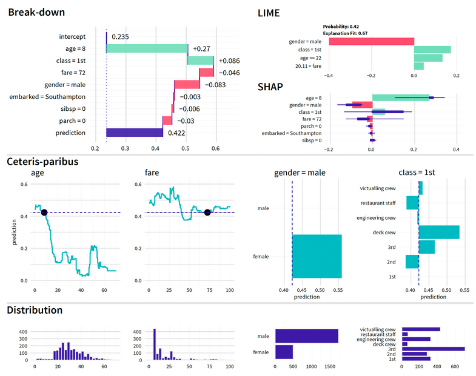

layout: true

<!-- background-image: url(./figs/upf.png) -->
background-position: 100% 0%, 100% 0%, 50% 100%
background-size: 10%, 10%, 10%

```{r, echo = FALSE}

knitr::opts_chunk$set(warning = FALSE,
                      message = FALSE,
                      fig.width = 10.5,
                      fig.height = 4,
                      comment = NA,
                      rows.print = 16,
                      echo = FALSE)

```


```{r, message = FALSE}
library(tidymodels)
library(tidyflow)
library(vip)
library(rpart.plot)
library(baguette)
library(tidyr)
library(patchwork)

data_link <- "https://raw.githubusercontent.com/cimentadaj/ml_socsci/master/data/pisa_us_2018.csv"
pisa <- read.csv(data_link)
```

---

# Bagging

* Decision trees can be very susceptible to the exact composition of the data

```{r manydtrees, echo = FALSE, dpi = 300, out.width = "100%", out.height = "100%", fig.align = 'center'}
mod1 <- decision_tree(mode = "regression") %>% set_engine("rpart")

tflow <-
  pisa %>%
  tidyflow(seed = 23151) %>%
  plug_split(initial_split) %>%
  plug_formula(math_score ~ . - scie_score - read_score) %>%
  plug_model(mod1)

all_mods <-
  lapply(c(.15, .55, .3, .75, .65, .5), function(size) {
    set.seed(23511)
    pisa_sim <- pisa %>% sample_frac(size, replace = TRUE)
    res <- tflow %>% replace_data(pisa_sim) %>% fit()
    pull_tflow_fit(res)$fit
})

par(mfrow = c(2, 3))
for (i in all_mods) rpart.plot(i)
```

---

# Bagging

* Bagging is a generalization of decision trees but using bootstrapped trees

* What is bootstrapping?

.center[
```{r}
sel_cols <- c("math_score", "HISEI", "REPEAT", "IMMIG", "read_score")
pisa_small <- pisa[1:10, sel_cols]
pisa_small$id <- 1:10
pisa_small
```
]

---

# Bagging

* Bootstraping randomly picks observations from the sample.

* Some observations might get picked while others might not.

* Some observations might even get picked many times!

.center[
```{r}
# Sample from the number of rows in `pisa_small`
# and allow certain numbers to be replaced.
set.seed(23551)
row_index <- sample(nrow(pisa_small), replace = TRUE)
pisa_small[row_index, ]
```
]

---

# Bagging

* We can run this many times and get many **resamples** of our data:

.center[
```{r}
nrow_small <- 5
lapply(1:2, function(x) {
  row_index <- sample(nrow_small, replace = TRUE)
  pisa_small[row_index, ]
})
```
]

---

# Bagging

* Bagging works by bootstraping your data $N$ times and fitting $N$ decision trees.
<br>

* Each of decision tree has a lot of variance because we allow the tree to overfit the data
<br>

* The trick with bagging is that we **average** over the predictions of all the $N$ decision trees
<br>

* This improves the high variability of each single decision tree.
<br>

* Loop over these $N$ datasets, fit a decision tree to each one and predict on the original data.

```{r}
pisa$id <- 1:nrow(pisa)
bootstrap_pisa <-
  lapply(1:20, function(x) {
    row_index <- sample(nrow(pisa) * .6, replace = TRUE)
    pisa[row_index, ]
  })
```


```{r }
tflow <-
  tidyflow() %>%
  plug_formula(math_score ~ .) %>%
  plug_model(decision_tree(mode = "regression") %>% set_engine("rpart"))

all_pred_models <-
  lapply(bootstrap_pisa, function(x) {
    small_model <-
      tflow %>%
      plug_data(x) %>%
      fit()

    cbind(
      pisa["id"],
      predict(small_model, new_data = pisa)
    )
  })
```

---

# Bagging

* The first model contains predictions for all respondents:

.center[
```{r}
head(all_pred_models[[1]], n = nrow_small)
```
]

* Second model contains also a set of predictions

.center[
```{r}
head(all_pred_models[[2]], n = nrow_small)
```
]
---

# Bagging


* Bagging compensates the high level of variance of each model by averaging the predictions of all the small trees

* Take the $N$ predictions and average over them for each respondent:

.center[
```{r}
# Combine all the 20 predictions into one data frame
all_combined <- all_pred_models[[1]]
for (i in seq_along(all_pred_models)[-1]) {
  all_combined <- cbind(all_combined, all_pred_models[[i]][-1])
}

# Average over the 20 predictions
res <- data.frame(
  id = all_combined[1],
  pred_1 = round(all_combined[[2]], 0),
  pred_2 = round(all_combined[[3]], 0),
  pred_3 = round(all_combined[[4]], 0),
  pred_N = "...",
  final_pred = round(rowMeans(all_combined[-1]), 0)
)

# Final prediction for each respondent
head(res, n = 10)
```
]

---

# Bagging

* The higher the number of trees, the better.

```{r, echo = FALSE, out.width = "40%", fig.align = 'center'}
knitr::include_graphics("../../../img/bagging_sim.png")
```

---

# Bagging

<br>
<br>
<br>

* Let's fit both a simple decision tree and the bagged decision tree, predict on the training set and record the average $RMSE$ for both:

.center[
```{r}
btree <- bag_tree(mode = "regression") %>% set_engine("rpart", times = 50)

tflow <-
  tidyflow(pisa, seed = 566521) %>%
  plug_split(initial_split) %>%
  plug_formula(math_score ~ .) %>%
  plug_model(btree)

res_btree <- tflow %>% fit()
res_dtree <- tflow %>% replace_model(decision_tree() %>% set_engine("rpart")) %>% fit()

rmse_dtree <- res_dtree %>% predict_training() %>% rmse(math_score, .pred)
rmse_btree <- res_btree %>% predict_training() %>% rmse(math_score, .pred)

c("Decision tree" = rmse_dtree$.estimate,
  "Bagged decision tree" = rmse_btree$.estimate)
```
]

* The bagged decision tree is considerably more accurate than the simple decision tree

---

# Disadvantages of bagging

* Less interpretability

* Alternative, VIP plots:

.center[
```{r, dpi = 300, out.width = "100%", out.height = "100%", fig.align = 'center'}
res_btree %>%
  pull_tflow_fit() %>%
  .[['fit']] %>%
  var_imp() %>%
  head(n = 10) %>%
  ggplot(aes(x = term, y = value)) +
  geom_point() +
  theme_minimal() +
  coord_flip()

```
]

---

# Disadvantages of bagging

<br>
<br>
<br>

* Works well only for models which are very unstable.

* For example, linear regression and logistic regression are models with very little variance

* With enough sample size, running a bagged linear regression should return very similar estimates as a single fitted model.

---

# Random Forests

* Excluded `scie_score` and `read_score` from tree simulations

* Why did I do that? Because they are extremely correlated to `math_score`

* They dominate the entire tree:

```{r, echo = FALSE, dpi = 300, out.width = "70%", out.height = "70%", fig.align = 'center'}
mod1 <- decision_tree(mode = "regression") %>% set_engine("rpart")

tflow <-
  pisa %>%
  tidyflow(seed = 23151) %>%
  plug_split(initial_split) %>%
  plug_formula(math_score ~ .) %>%
  plug_model(mod1)

all_mods <-
  lapply(c(.15, .55, .3, .75, .65, .5), function(size) {
    set.seed(23511)
    pisa_sim <- pisa %>% sample_frac(size, replace = TRUE)
    res <- tflow %>% replace_data(pisa_sim) %>% fit()
    pull_tflow_fit(res)$fit
  })

par(mfrow=c(2,3))
for (i in all_mods) rpart.plot(i)
```

---

# Random Forests

* For estimating the split of `HISEI < 56`, decision trees evaluate splits in all variables in the data:

```{r, echo = FALSE, dpi = 300, out.width = "70%", out.height = "70%", fig.align = 'center'}
mod1 <- decision_tree(mode = "regression") %>% set_engine("rpart")

tflow <-
  pisa %>%
  tidyflow(seed = 23151) %>%
  plug_split(initial_split) %>%
  plug_formula(math_score ~ MISCED + FISCED + HISEI + REPEAT + IMMIG + DURECEC + BSMJ) %>%
  plug_model(mod1)

vanilla_fit <- fit(tflow)
tree <- pull_tflow_fit(vanilla_fit)$fit
cols <- c("black", "grey", "grey", "grey", "grey", "grey", "grey", "grey", "grey", "grey", "grey")
rpart.plot(tree, col = cols, branch.col = cols, split.col = cols)
```

---

# Random Forests

* Repeats the same for each node

```{r, echo = FALSE, dpi = 300, out.width = "70%", out.height = "70%", fig.align = 'center'}
cols <- c("black", "black", "grey", "grey", "black", "grey", "grey", "grey", "grey", "grey", "grey")
rpart.plot(tree, col = cols, branch.col = cols, split.col = cols)
```

---

# Random Forests

* Random forests sample `N` variables at each split

> For example, to determine the best split for the left branch, it randomly samples `r floor(ncol(pisa) / 2)` variables from the total of `r ncol(pisa)`

* On average, all variables will be present across all splits for all trees

* This approach serves to **decorrelate** the trees

---

# Random Forests

* How many columns should we randomly sample at each split?

* This argument called `mtry` and the defaults are:

<br>

.center[
$\sqrt{Total\text{ }number\text{ }of\text{ }variables}$
]

<br>

.center[
$\frac{Total\text{ }number\text{ }of\text{ }variables}{3}$
]


```{r}
# Define the random forest
rf_mod <- rand_forest(mode = "regression") %>% set_engine("ranger", importance = "impurity")

# Define the `tidyflow` with the random forest model
# and include all variables (including scie_score and read_score)
tflow <-
  pisa %>%
  tidyflow(seed = 23151) %>%
  plug_formula(math_score ~ .) %>%
  plug_split(initial_split) %>%
  plug_model(rf_mod)

rf_fitted <- tflow %>% fit()
```

---

# Random Forests

* `scie_score` and `read_score` seem to be the most relevant variables.

* They both are **seven times** more important than the next most strongest variable

```{r, dpi = 300, out.width = "70%", out.height = "70%", fig.align = 'center'}
rf_fitted %>%
  pull_tflow_fit() %>%
  .[['fit']] %>%
  vip() +
  theme_minimal()
```

---

# Disadvantages of random forests

* When there are **only** a few very strong predictors, then you might have trees which are very week

* Based on our example, if `scie_score` and `read_score` are excluded, the predictions might be bad

.center[
```{r }
rf_fitted %>%
  predict_training() %>%
  rmse(math_score, .pred)
```
]

* Performs worse than bagging, which was around `11` math points!

---

# Disadvantages of random forests

* If we increase the number of variables used at each split, we should see a decrease in error

* Why? Because it means that `scie_score` and `read_score` will have greater probability of being included at each split.

.center[
```{r}
rf_mod <- rand_forest(mode = "regression", mtry = 150) %>% set_engine("ranger")
rf_fitted <- tflow %>% replace_model(rf_mod) %>% fit()

rf_fitted %>%
  predict_training() %>%
  rmse(math_score, .pred)
```
]

* The predictive error is reduced to be the same as the one from the bagged decision tree

* However, it's much faster than bagged decision trees!

* Less interpretable

---

# Advantages of random forests

<br>
<br>

* Quite good for off-the-shelf predictions

<br>

* Works equally well for continuous and binary variables

<br>

* Usually performs better than linear models by exploring complicated interactions

---

# Tuning random forests

* Random Forests also have other values to tune.

* `mtry`: number of variables

* `min_n`: minimum number of observations in each node

* `trees`: number of trees fitted

See https://bradleyboehmke.github.io/HOML/random-forest.html

---

# Boosting

* Tree based methods we've seen use decision trees as baseline models

* They use *ensemble* approaches to calculate the average predictions of all decision trees

* Boosting also uses decision trees as the baseline model but the ensemble strategy is fundamentally different

* Manual example: let's fit a very weak decision tree

---
# Boosting

```{r, dpi = 300, out.width = "100%", fig.align = 'center'}
dt_tree <-
  decision_tree(mode = "regression", tree_depth = 1, min_n = 10) %>%
  set_engine("rpart")

pisa_tr <- training(initial_split(pisa))
tflow <-
  tidyflow(pisa_tr, seed = 51231) %>%
  plug_formula(math_score ~ scie_score) %>%
  plug_model(dt_tree)

mod1 <- fit(tflow)
mod1 %>% pull_tflow_fit() %>% .[['fit']] %>% rpart.plot()
```

---
# Boosting

* Weak model with `tree_depth = 1`

* What is the $RMSE$?

.center[
```{r }
res_mod1 <-
  pisa_tr %>%
  cbind(., predict(mod1, new_data = .))

res_mod1 %>%
  rmse(math_score, .pred)
```
]

* Neither a good nor a robust model.

---
# Boosting

* Let's look at the residuals:

```{r, dpi = 300, out.width = "100%", fig.align = 'center'}
res_mod1 <- res_mod1 %>%  mutate(.resid = math_score - .pred)
res_mod1 %>%
  ggplot(aes(scie_score, .resid)) +
  geom_point(alpha = 1/3) +
  scale_x_continuous(name = "Science scores") +
  scale_y_continuous(name = "Residuals") +
  theme_minimal()
```

* A strong pattern, something we shouldn't see if our models is working well.

---

# Boosting

* Boosting works by predicting the residuals of previous decision trees.

1. Fit a first model and calculated the residuals
2. Fit a second model but the dependent variable should now be the residuals of the first model
3. Recursively fit $N$ trees following this pattern

```{r, dpi = 300, out.width = "100%", fig.align = 'center'}
# Convert `math_score` to be the residuals of model 1
res_mod1 <- mutate(res_mod1, math_score = .resid)
# Replace the new data in our `tflow` In the data `res_mod1`, `math_score` is
# now the residuals of the first model
mod2 <- tflow %>% replace_data(res_mod1) %>% fit()
mod2 %>% pull_tflow_fit() %>% .[['fit']] %>% rpart.plot()
```

---

# Boosting

* Let's visualize the residuals from the **second** model:

```{r, dpi = 300, out.width = "70%", fig.align = 'center'}
res_mod2 <- pisa_tr %>% cbind(., predict(mod2, new_data = .)) %>% mutate(.resid = math_score - .pred)

res_mod2 %>%
  ggplot(aes(scie_score, .resid)) +
  geom_point(alpha = 1/3) +
  scale_x_continuous(name = "Science scores") +
  scale_y_continuous(name = "Residuals") +
  theme_minimal()
```

* Pattern seems to have changed although it's not clear that it's closer to a random pattern

---
# Boosting

* If we repeat the same for 20 trees, residuals approximate randomness:


```{r, echo = FALSE, dpi = 300, out.width = "100%", out.height = "100%", fig.align = 'center'}

dt_tree <-
  decision_tree(mode = "regression", tree_depth = 1, min_n = 10) %>%
  set_engine("rpart")

pisa_tr <- training(initial_split(pisa))

tflow <-
  pisa_tr %>%
  tidyflow(51231) %>%
  plug_formula(math_score ~ scie_score) %>%
  plug_model(dt_tree)

n <- 20
res <- vector("list", n)
df_resid <- data.frame(resid_1 = rep(0, nrow(pisa_tr)))
res[[1]] <- fit(tflow)

for (i in 1:(n-1)) {
  df_pred <- predict(res[[i]], new_data = pull_tflow_rawdata(res[[i]]))[[1]]
  pred_data <-
    cbind(
      pull_tflow_rawdata(res[[i]]),
      .pred = df_pred
    )

  df_resid[[paste0("resid_", i)]] <- with(pred_data, math_score - .pred)

  pred_data <-
    pred_data %>%
    mutate(math_score = math_score - .pred) %>%
    select(-.pred)

  res[[i + 1]] <-
    tflow %>%
    replace_data(pred_data) %>%
    fit()
}

p1 <-
  df_resid %>%
  cbind(pisa_tr["scie_score"]) %>%
  ggplot(aes(scie_score, resid_1)) +
  geom_point(alpha = 1/9) +
  scale_y_continuous("Residuals") +
  scale_x_continuous(name = NULL) +
  ggtitle("Residuals of 1st model") +
  theme_minimal() +
  theme(plot.title = element_text(hjust = 0.5, size = 10))

p2 <-
  df_resid %>%
  cbind(pisa_tr["scie_score"]) %>%
  ggplot(aes(scie_score, resid_7)) +
  geom_point(alpha = 1/9) +
  scale_y_continuous("Residuals") +
  scale_x_continuous(name = NULL) +
  ggtitle("Residuals of 7th model") +
  theme_minimal() +
  theme(plot.title = element_text(hjust = 0.5, size = 10))

p3 <-
  df_resid %>%
  cbind(pisa_tr["scie_score"]) %>%
  ggplot(aes(scie_score, resid_19)) +
  geom_point(alpha = 1/9) +
  scale_y_continuous("Residuals") +
  scale_x_continuous("Science score") +
  ggtitle("Residuals of 19th model") +
  theme_minimal() +
  theme(plot.title = element_text(hjust = 0.5, size = 10))

dots <-
  ggplot() +
  theme_void() +
  scale_x_continuous(limits = c(0, 1)) +
  scale_y_continuous(limits = c(0, 1)) +
  annotate("text", .5, .8, label = ".", size = 7) +
  annotate("text", .5, .6, label = ".", size = 7) +
  annotate("text", .5, .4, label = ".", size = 7)


list(p1, dots, p2, dots, p3) %>%
  wrap_plots(ncol = 1) &
  theme(aspect.ratio = 0.15)

```

---
# Boosting

* Boosting is a way for each model to boost the last model's performance:
 + Focuses mostly on observations which had big residuals

* After having 20 predictions for each respondent, can you take the average?

.center[
```{r}
mod1_pred <- predict(mod1, new_data = pisa_tr)
names(mod1_pred) <- "pred_mod1"
mod2_pred <- predict(mod2, new_data = pisa_tr)
names(mod2_pred) <- "pred_mod2"
resid_pred <- cbind(mod1_pred, mod2_pred)

head(resid_pred, n = 10)
```
]

---
# Boosting

* The first model has the correct metric but all the remaining models are residuals

* Final prediction is the **sum** of all predictions

```{r}
resid_pred$final_pred <- rowSums(resid_pred)
head(resid_pred)
```

* We have a final prediction for each respondent.

---

# Boosting


* Let's compare this to our previous models using decision trees and random forests for the training dataset:

```{r}
boost_mod <-
  boost_tree(mode = "regression", trees = 500) %>%
  set_engine("xgboost")

tflow <-
  pisa %>%
  tidyflow(seed = 51231) %>%
  plug_formula(math_score ~ .) %>%
  plug_split(initial_split) %>%
  plug_model(boost_mod)

boot_res <- fit(tflow)

rmse_gb_train <-
  boot_res %>%
  predict_training() %>%
  rmse(math_score, .pred)

## gb_rmse <-
##   boot_res %>%
##   predict_testing() %>%
##   rmse(math_score, .pred) %>%
##   pull(.estimate)

## c("Extreme Gradient Boosting" = gb_rmse)

rmse_gb_train
```

---
# Boosting

* Boosting outperforms all others considerably

* Boosting and `xgboost` are considered to be among the best predictive models

* They can achieve great accuracy even with default values

---

# Disadvantages of boosting

* Increasing the number of trees in a boosting algorithm **can** increase overfitting

* For the random forest, increasing the number of trees has no impact on overfitting

* You might reach a point that adding more trees will just try to explain residuals which are random, resulting in overfitting.

* `stop_iter` signals that after $N$ number trees have passed without any improvement, the algorithm should stop. This approach often runs less trees than the user requested.

---
# Boosting

There are other tuning parameters available in `boost_tree` which you can use to improve your model:

* `trees`: the number of trees that will be ran

* `mtry`: just as in random forests

* `min_n`: minimum number in each node

* `tree_depth`: how complex the tree is grown

* `learn_rate`: controls how much we regularize each tree

* `loss_reduction`: signals the amount of reduction in your loss function (for example, $RMSE$) that will allow each split in a decision tree to continue to grow. You can see this as cost-effective step: only if the tree improves it's prediction by $X$, we allow the tree to produce another split.

* `sample_size`: controls the percentage of the data used in each iteration of the decision tree. This is similar to the bagging approach where we perform bootstraps on each iteration.

---

# Comparison of all models

.center[
```{r}
results <- data.frame(
  model = c("Ridge Regression", "Lasso Regression", "Elastic Net", "Decision tree", "Bagged decision tree", "Random Forest", "Gradient boosting"), #nolintr
  train = c(76.87, 76.87, 76.87, 33.85, 11.33, 11.3, 0.0006),
  test = c(77.88, 77.86, 77.87, 34.9, 28.9, 28.5, 26.8)
)

results
```
]

---

# Explainability

```{r, echo = FALSE, out.width = "60%", fig.align = 'center'}

```
 
---

# Ending remarks


```{r, echo = FALSE, out.width = "60%", fig.align = 'center'}

```

.center[
https://cimentadaj.github.io/ml_socsci/
]
